## Resumen

Se realizó un sistema de alarma domiciliario con funciones de advertencia, alarma y activación/desactivación mediante contraseña. 

Consiste en un sistema que monitorea la abertura de una casa mediante sensores magnético y ultrasónico. Emite sonidos de advertencia mediante _buzzer_ si detecta presencia frente a la abertura y sonidos de alarma de mayor volumen mediante bocina si dicha presencia persiste o si la abertura fue abierta. Un usuario puede ver el estado del sistema mediante un smartphone conectado a una red _Wi-Fi_.

Para el desarrollo del proyecto se usó conceptos aprendidos en el curso de sistemas embebidos, como por ejemplo el paradigma de la programación orientada a objetos implementado en el lenguaje C++, el uso de máquina de estados, interrupciones y el protocolo _Wi-Fi_ entre otros. En cuanto al hardware se destaca el uso de la placa _NUCLEO-F401RE_ en donde se implementó el sistema principal y la placa _NodeMCU-32S_ en donde se implementó el servidor _TCP_.

## Abstract

A home alarm system was created with warning, alarm and password activation/deactivation functions.

It consists of a system that monitors the opening of a house using magnetic and ultrasonic sensors. It emits warning sounds using a buzzer if it detects presence in front of the opening and louder alarm sounds using a horn if said presence persists or if the opening was opened. A user can view the status of the system using a smartphone connected to a Wi-Fi network.

For the development of the project, concepts learned in the embedded systems course were used, such as the object-oriented programming paradigm implemented in the C++ language, the use of state machines, interruptions and the Wi-Fi protocol, among others. Regarding the hardware, the use of the _NUCLEO-F401RE_ board where the main system was implemented and the _NodeMCU-32S_ board where the TCP server was implemented are highlighted.


## Agradecimientos

Quiero agradecer a todos los docentes que hicieron posible que este curso se pueda realizar: Ariel Lutenberg, Sergio Caprile, Juan Manuel Reta, Eduardo Filomena, Juan Manuel Cruz y demás colaboradores. Gracias por haberme dado la oportunidad de participar y por proporcionarme la placa de desarrollo NUCLEO-F401RE, para que pueda desarrollar el curso. El libro, las clases de repaso, las devoluciones y la práctica me han enriquecido muchísimo. Han sido varios meses de disfrute de la actividad de aprender y desarrollar el proyecto; no ha sido fácil, pero finalicé el curso y el proyecto con la satisfacción de haber crecido profesionalmente un poco más. También quiero agradecer a mi familia que me apoyó de muchas maneras para que tenga tiempo para cursar, su apoyo ha sido clave a la hora de aprovechar esta oportunidad.


## Índice 

## Listado de figuras

Figura 1. Diagrama en bloques del sistema.

Figura 2. Placa de desarrollo NodeMCU-32S de la empresa AI-Thinker Co.

Figura 3. Detalle de los pines (_pinout_) de la placa NodeMCU-32S.

Figura 4. Diagrama de clases de la estructura del patrón de diseño estado.

Figura 5. Diagrama en bloques del hardware del sistema.

Figura 6. Diagrama esquemático del sistema.

Figura 7. Diagrama de módulos de software.

Figura 8. Ejemplo de pantalla de interfaz de usuario visualizada mediante navegador web.

Figura 9. Diagrama de máquina de estados del sistema 'alarm'. 

Figura 10. Diagrama de máquina de estados del sistema 'wifi'. 

Figura 11. Vista frontal del sistema probado. 

Figura 12. Vista superior del sistema probado.

## Listado de tablas

Tabla 1. Comparación entre diferentes productos existentes en el mercado similares a la idea de proyecto.

Tabla 2. Requisitos del sistema.

Tabla 3. Caso de uso N° 1.

Tabla 4. Caso de uso N° 2.

Tabla 5. Caso de uso N° 3.

Tabla 6. Caso de uso N° 4.

Tabla 7. Conexiones del sistema.

Tabla 8. Listado de materiales del sistema.

Tabla 9. Descripción de los archivos utilizados para implementar el patrón de diseño estado.

Tabla 10. Comandos AT utilizados para configurar la placa *NodeMCU-ESP-32S* en modo servidor TCP.

Tabla 11. Comandos AT utilizados para establecer la comunicación entre la placa NUCLEO-F401RE y la interfaz de usuario a través del servidor TCP implementado en la placa *NodeMCU-ESP-32S*.

Tabla 12. Funciones globales utilizadas por `main.cpp`.

Tabla 13. Métodos públicos de la clase 'Alarm'.

Tabla 14. Métodos privados de la clase 'Alarm'.

Tabla 15. Métodos públicos de la clase 'Wifi'.

Tabla 16. Listado de cumplimiento de los requisitos propuestos en la tabla 2 de la sección 2.1 "Requisitos".

Tabla 17. Comparación entre el presente trabajo y los sistemas analizados en la tabla 1 de la sección 1.2 "Análisis de sistemas similares al desarrollado".

Tabla 18. Resumen con la información más relevante sobre el desarrollo del presente trabajo.

## Listado de fragmentos

Fragmento 1. Instanciación de máquinas de estado y detalle del super *loop*.

Fragmento 2. Vista de árbol de los archivos del presente trabajo.

Fragmento 3. Etiqueta meta utilizada para refrescar la página web automáticamente cada 5 segundos.

Fragmento 4. Implementación de la lectura del teclado matricial.

Fragmento 5. Implementación de la actualización de los reportes del sensor ultrasónico y magnético.

Fragmento 6. Ejemplo de mensaje recibido cuando un dispositivo accede a la dirección IP asignada a la placa ESP-WROOM-32S.

Fragmento 7. Transiciones desde el estado 'WAIT' hacia los estados 'CIPSTATE', 'CIPSEND' y reingreso al mismo estado.

Fragmento 8. Ejemplo de respuesta de la herramienta ESP-AT ante el comando `AT+CIPSTATE?`.

Fragmento 9. Implementación de intentos de envío del archivo HTML.

## Capítulo 1 - Introducción general
### 1.1 Idea de proyecto

El proyecto consiste en un sistema que monitorea la abertura de una casa mediante sensores magnético y ultrasónico para avisar al usuario mediante Wi-Fi si la abertura fue abierta. Cuenta con sonidos de advertencia mediante buzzer si detecta presencia frente a la abertura y sonidos de alarma de mayor intensidad mediante bocina si dicha presencia persiste o si la abertura fue abierta. 

En la figura 1 se presenta el diagrama en bloques del sistema. A continuación se proporciona más información sobre el rol de cada uno los periféricos a utilizar: 
- Placa NÚCLEO-F401RE: Unidad central de procesamiento.
- Sensor magnético: Similar al de [este link](https://www.mercadolibre.com.ar/sensor-magnetico-para-alarma-puerta-ventana-precableado/p/MLA28522217#polycard_client=search-nordic&searchVariation=MLA28522217&position=13&search_layout=stack&type=product&tracking_id=d17efc7b-a2ca-45d7-8cee-286b9a0e3c41&wid=MLA1400275267&sid=search). La separación del par indicará que la abertura está abierta. Irá colocado sobre las hojas de la ventana.
- Sensor ultrasónico: Similar al de [este link](https://www.mercadolibre.com.ar/sensor-ultrasonico-ultrasonido-hc-sr04-arduino-pic-robotica/p/MLA32487259#polycard_client=search-nordic&searchVariation=MLA32487259&position=2&search_layout=grid&type=product&tracking_id=9d0eb95d-a09c-4aa9-a774-c3e061973915&wid=MLA1666030294&sid=search). Irá colocado sobre la parte superior del marco exterior de la ventana (sobre la mucheta de la abertura) y, cuando no tenga algún obstáculo en su camino, la distancia medida será igual a la altura del marco de la ventana (considerando que el obstáculo en condiciones normales será la mucheta de la ventana). Se espera que ante la detección de un obstáculo la distancia medida será menor.
- Buzzer: Irá colocado en la parte exterior de la ventana y se activará de acuerdo la detección de algún obstáculo por parte del sensor ultrasónico.
- Bocina: Irá colocado en la parte exterior de la ventana y se activará de acuerdo a la señal de apertura del sensor magnético.
- LED: Indicará que el sistema está activándose (permaneciendo encendido) o activo (parpadeando).
- GUI smartphone: Indicará al usuario los eventos.
- Teclado matricial: Permitirá al usuario activar/desactivar el sistema mediante contraseña.

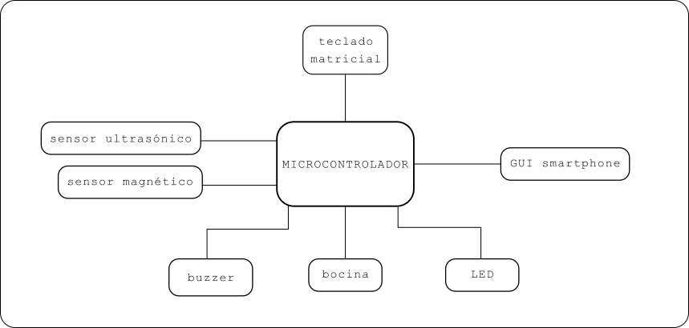

Figura 1. Diagrama en bloques del sistema.

Los valores que agrega este proyecto son varios. En principio la posibilidad de aprendizaje, teniendo en cuenta el uso del paradigma de la programación orientada a objetos en el lenguaje C++, el uso de máquina de estados y el protocolo _Wi-Fi_. Luego, la satisfacción de una necesidad personal, debido a un robo en mi hogar recientemente. Otro elemento a destacar es el estado de advertencia implementada mediante un _buzzer_ antes de hacer sonar la sirena principal, si es que la señal de advertencia se mantiene activa durante cierto tiempo programado. Por último, este proyecto es de suma importancia para que los usuarios tengan más tranquilidad, sobre todo durante el tiempo de descanso nocturno, mejorando la calidad del sueño.

Cabe destacar que este proyecto se considera como una primer etapa de un sistema de alarma para el hogar. En implementaciones futuras se considera agregar etapas en donde se involucren sensores infrarrojos y magnéticos para colocar sobre puertas y otras ventanas e introducir nuevas funcionalidades que mejoren la experiencia del usuario. Debido a los tiempos de implementación se propone este proyecto como final del curso con la idea de lograr un proyecto alcanzable en un corto tiempo.
### 1.2 Análisis de sistemas similares al desarrollado

Para este trabajo se analizó previamente diferentes productos existentes en el mercado. Se buscó una solución para aberturas individuales, que no llegue a convertirse en un sistema centralizado convencional que incluya un conjunto de aberturas dividido por zonas. A continuación, en la tabla 1, se presentan las opciones evaluadas. De todas ellas, se destaca el precio, el cual es inferior a USD 29, también la alimentación a pilas y la conectividad _Wi-Fi_. 

| Características          |                                                                                                                            Sensor Magnético Para Puertas Ventanas Programable GADNIC                                                                                                                            |                                                                                                                   Sensor Puerta Ventanas Smart Macroled                                                                                                                    |                                                                                                                               Sensor Wifi Para Puertas Y Ventanas Inteligente Magnetico Smart Life Demasled                                                                                                                                |
| ------------------------ | :-------------------------------------------------------------------------------------------------------------------------------------------------------------------------------------------------------------------------------------------------------------------------------------------------------------: | :------------------------------------------------------------------------------------------------------------------------------------------------------------------------------------------------------------------------------------------------------------------------: | :----------------------------------------------------------------------------------------------------------------------------------------------------------------------------------------------------------------------------------------------------------------------------------------------------------------------------------------: |
| Link                     | [link](https://www.mercadolibre.com.ar/sensor-magnetico-para-puertas-ventanas-programable-gadnic-color-blanco/p/MLA37727542#polycard_client=search-nordic&searchVariation=MLA37727542&position=7&search_layout=grid&type=product&tracking_id=81ffb99e-d582-43cb-87d1-817b66405685&wid=MLA1880559174&sid=search) | [link](https://www.mercadolibre.com.ar/sensor-puerta-ventanas-smart-macroled-facil-instalacion/p/MLA24158832/#reco_backend=comparator-default-odin&reco_client=pdp_comparator&reco_product_pos=2&reco_backend_type=low_level&reco_id=ee344f98-218d-4ddd-b875-011309416c22) | [link](https://www.mercadolibre.com.ar/sensor-wifi-para-puertas-y-ventanas-inteligente-magnetico-smart-life-demasled/p/MLA37369089?pdp_filters=seller_id%3A182950451#reco_item_pos=0&reco_backend=machinalis-seller-items-pdp&reco_backend_type=low_level&reco_client=pdp-seller_items-above&reco_id=92a71589-3e92-4cdc-9826-c5ef6566d1da) |
| Precio (fecha 3/10/2024) |                                                                                                                                                   $ 24.499,00                                                                                                                                                   |                                                                                                                                  $ 35.030                                                                                                                                  |                                                                                                                                                                  $21.850                                                                                                                                                                   |
| Inalámbrico              |                                                                                                                                            Sí. Con Wi-Fi y Bluetooth                                                                                                                                            |                                                                                                                               Sí. Con Wi-Fi.                                                                                                                               |                                                                                                                                                               Sí. Con Wi-Fi.                                                                                                                                                               |
| Display LCD              |                                                                                                                                                       NO                                                                                                                                                        |                                                                                                                                     NO                                                                                                                                     |                                                                                                                                                                     NO                                                                                                                                                                     |
| Código de seguridad      |                                                                                                                                        No. Se activa/desactiva con botón                                                                                                                                        |                                                                                                                     No. Se activa/desactiva con botón                                                                                                                      |                                                                                                                                                     No. Se activa/desactiva con botón                                                                                                                                                      |
| Compatible con App       |                                                                                                                                                       Sí                                                                                                                                                        |                                                                                                                                     Sí                                                                                                                                     |                                                                                                                                                                     Sí                                                                                                                                                                     |
| Sensores                 |                                                                                                                                         1 sensor magnético inalámbrico                                                                                                                                          |                                                                                                                       1 sensor magnético inalámbrico                                                                                                                       |                                                                                                                                                       1 sensor magnético inalámbrico                                                                                                                                                       |
| Sonido                   |                                                                                                                                                       SÍ                                                                                                                                                        |                                                                                                                                     NO                                                                                                                                     |                                                                                                                                                                     SÍ                                                                                                                                                                     |

Tabla 1. Comparación entre diferentes productos existentes en el mercado similares a la idea de proyecto

## Capítulo 2 - Introducción específica
### 2.1 Requisitos

En la tabla 2 se presentan los requisitos del sistema.

| Grupo             | Id  | Descripción                                                                                                                                                                                                                                                                                                                                                                                                                      |
| ----------------- | --- | -------------------------------------------------------------------------------------------------------------------------------------------------------------------------------------------------------------------------------------------------------------------------------------------------------------------------------------------------------------------------------------------------------------------------------- |
| 1. LED            | 1.1 | Debe encenderse cuando la alarma está activa                                                                                                                                                                                                                                                                                                                                                                                     |
|                   | 1.2 | Debe apagarse cuando la alarma está inactiva                                                                                                                                                                                                                                                                                                                                                                                     |
|                   | 1.3 | Debe titilar cuando el usuario esté ingresando una contraseña y volver a su estado anterior en caso de contraseña incorrecta. Esto es, debe apagarse el LED si el usuario quiere activar el sistema pero ingresa una contraseña incorrecta o se agota el tiempo de espera o debe encenderse el LED si el sistema está activo y el usuario quiere desactivarlo e ingresa una contraseña incorrecta o se agota el tiempo de espera |
| 2. NUCLEO F401RE  | 2.1 | Debe solicitar una contraseña de 4 dígitos para activar/desactivar el sistema que se ingresará mediante el teclado matricial                                                                                                                                                                                                                                                                                                     |
|                   | 2.2 | Debe tener un tiempo límite de espera de 30 segundos para desactivar la alarma                                                                                                                                                                                                                                                                                                                                                   |
|                   | 2.3 | Debe esperar treinta segundos para activar la alarma una vez que se ingresa la contraseña correcta. Esto es con la intención de brindar la posibilidad al usuario de salir de la casa antes de que el sistema se active.                                                                                                                                                                                                         |
|                   | 2.4 | Debe establecer un estado de advertencia mientas el sensor ultrasónico arroje una medición inferior a la altura del marco de la ventana con una tolerancia de ±5% de esa longitud                                                                                                                                                                                                                                                |
|                   | 2.5 | Debe establecer un estado de alarma si el estado de advertencia permaneció activo durante más de 30 segundos                                                                                                                                                                                                                                                                                                                     |
|                   | 2.6 | Debe establecer un estado de alarma si se separó el par de contactos magnéticos y el sistema está activo                                                                                                                                                                                                                                                                                                                         |
| 3. Buzzer 1       | 3.1 | Debe emitir pitidos intermitentes cada 500 ms si el estado de advertencia está activo                                                                                                                                                                                                                                                                                                                                            |
|                   | 3.2 | No debe emitir sonido mientras el sistema no esté en estado de advertencia                                                                                                                                                                                                                                                                                                                                                       |
| 4. Buzzer 2       | 4.1 | Debe emitir pitidos intermitentes cada 1000 ms durante 30 segundos, en el periodo entre que se ingresa la contraseña correcta y se cumplen el tiempo de espera para entrar en estado de activación                                                                                                                                                                                                                               |
|                   | 4.2 | Debe emitir dos pitidos con un silencio en el medio cuando el sistema agotó el tiempo de espera para activarse (30 segundos) y entró en el estado activo                                                                                                                                                                                                                                                                         |
|                   | 4.3 | Debe emitir dos pitidos con un silencio en el medio cuando el sistema está activo y el usuario ingresa la contraseña correcta para desactivar                                                                                                                                                                                                                                                                                    |
| 5. Bocina         | 5.1 | Debe sonar la bocina si el estado de alarma está activo                                                                                                                                                                                                                                                                                                                                                                          |
|                   | 5.2 | No debe sonar la bocina si el estado de alarma no está activo o si el mismo está activo pero se ingresa la contraseña correcta para desactivar el sistema                                                                                                                                                                                                                                                                        |
| 6. Pulsador       | 6.1 | Debe hacer sonar la bocina mientras el pulsador está presionado                                                                                                                                                                                                                                                                                                                                                                  |
|                   | 6.2 | No debe realizar disparar ninguna acción si el pulsador no es presionado                                                                                                                                                                                                                                                                                                                                                         |
| 7. GUI smartphone | 7.1 | Al conectarse al sistema debe leer el estado activo/inactivo de los sensores ultrasónico y magnético. Asimismo debe leer si el sistema está activo o inactivo.                                                                                                                                                                                                                                                                   |

Tabla 2. Requisitos del sistema.

### 2.2 Casos de uso

Se diseñó casos de uso para probar la funcionalidad del sistema. Los mismos se presentan en las tablas 3, 4, 5 y 6.

| CU 1              | El usuario desea activar el sistema                                                                                                                                                                     |
| ----------------- | ------------------------------------------------------------------------------------------------------------------------------------------------------------------------------------------------------- |
| Disparador        | El usuario desea activar el sistema                                                                                                                                                                     |
| Precondición      | La alimentación del sistema está conectada y el sistema está inactivo.                                                                                                                                  |
| Flujo básico      | El usuario ingresa la contraseña correcta mediante el teclado matricial, el LED se mantiene encendido durante 30 segundos y finalizado ese periodo el sistema queda parpadeando y entra en modo activo. |
| Flujo alternativo | El usuario no ingresa la contraseña correcta. En ese caso el sistema no se activa.                                                                                                                      |

Tabla 3. Caso de uso N° 1.

| CU 2              | El sistema debe entrar en modo advertencia                                                                                                                                                                 |
| ----------------- | ---------------------------------------------------------------------------------------------------------------------------------------------------------------------------------------------------------- |
| Disparador        | El sistema detecta un obstáculo en el rango de detección del sensor ultrasónico                                                                                                                            |
| Precondición      | El sistema está activo, el sensor ultrasónico arroja un valor medido de distancia igual a la altura del marco de la ventana y par de sensores magnéticos están juntos (indica que la ventana está cerrada) |
| Flujo básico      | El buzzer (que está colocado en la ventana) emite un sonido discontinuo mientras el obstáculo esté presente. Si el obstáculo desaparece el sonido finaliza.                                                |
| Flujo alternativo | El obstáculo no es detectado por el sensor ultrasónico y el buzzer no suena. Si la ventana se abre el sistema debe entrar en modo alarma y hacer sonar la bocina.                                          |

Tabla 4. Caso de uso N° 2.

| CU 3              | El sistema debe entrar en modo peligro                                                                                                                                                              |
| ----------------- | --------------------------------------------------------------------------------------------------------------------------------------------------------------------------------------------------- |
| Disparador        | El sistema detecta que los contactos magnéticos se separaron, indicando que la ventana fue abierta                                                                                                  |
| Precondición      | El sistema está activo y los contactos magnéticos están juntos.                                                                                                                                     |
| Flujo básico      | El sistema entra en modo peligro y hace sonar la bocina hasta que el usuario ingresa la contraseña correcta o se interrumpa la alimentación.                                                        |
| Flujo alternativo | La apertura de los contactos magnéticos no se detectó correctamente. El sistema debe entrar en modo peligro si el sensor ultrasónico detecta un obstáculo en su camino por más de treinta segundos. |

Tabla 5. Caso de uso N° 3.

| CU 4              | El usuario desea desactivar el sistema                                                                                                          |
| ----------------- | ----------------------------------------------------------------------------------------------------------------------------------------------- |
| Disparador        | El usuario desea desactivar el sistema                                                                                                          |
| Precondición      | La alimentación del sistema está conectada y el sistema está activo.                                                                            |
| Flujo básico      | El usuario ingresa la contraseña correcta mediante el teclado matricial y el sistema entra en modo inactivo                                     |
| Flujo alternativo | El usuario no ingresa la contraseña correcta. Si se ingresa una contraseña incorrecta el sistema permanece en el estado en el que se encuentra. |

Tabla 6. Caso de uso N° 4.

### 2.3 Descripción del módulo Wi-Fi

Para el trabajo realizado se empleó una placa de desarrollo *NodeMCU-32S*, similar a la que se muestra en la figura 2. El núcleo de este módulo es el chip ESP-WROOM-32S, el cual es un módulo Wi-Fi+BT+BLE de propósito general.
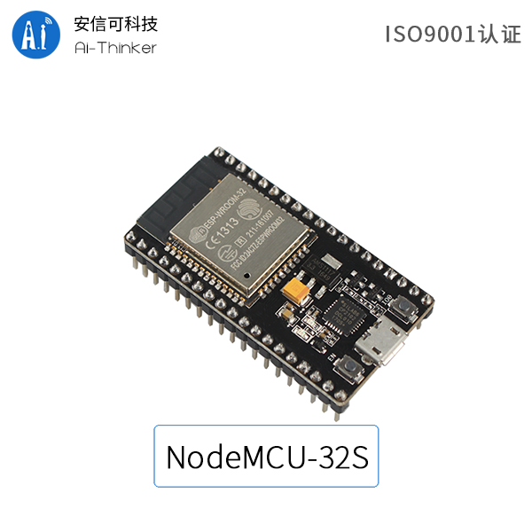

Figura 2. Placa de desarrollo NodeMCU-32S de la empresa AI-Thinker Co.

La placa *NodeMCU-32S* tiene un total de 38 interfaces. En la figura 3 se muestra el detalle de los pines [1].

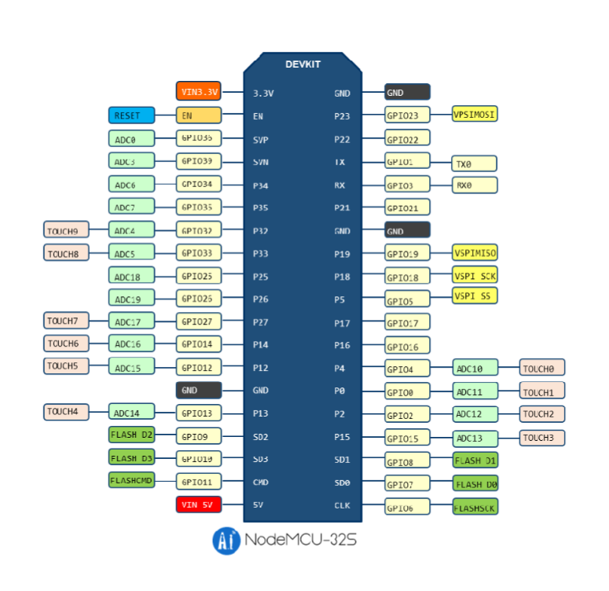

Figura 3. Detalle de los pines (_pinout_) de la placa NodeMCU-32S.

En el presente trabajo, para implementar la conectividad mediante *Wi-Fi*, se empleó la herramienta *ESP-AT* [2]. Esta herramienta es un proyecto desarrollado por la empresa *Espressif* (fabricante del chip ESP-32S). Hace que una placa *NodeMCU-32S* funcione como *subordinada* y una MCU como *manager*. En el presente trabajo la placa NUCLEO-F401RE actuó como manager. La MCU *manager* envía comandos AT a la placa *NodeMCU-32S* y recibe respuestas AT de vuelta. ESP-AT proporciona una amplia gama de comandos AT con diferentes funciones, como comandos Wi-Fi, comandos TCP/IP, comandos Bluetooth LE, comandos Bluetooth, comandos MQTT, comandos HTTP y comandos Ethernet. 

### 2.4 Descripción del patrón de diseño estado

Para la implementación de las máquinas de estado del presente trabajo se utilizó el concepto de patrón de diseño aplicado junto con el lenguaje de programación C++. Los patrones de diseño son soluciones habituales a problemas comunes en el diseño de software. Cada patrón es como un plano que se puede personalizar para resolver un problema de diseño particular de un código.
En particular, se utilizó el patrón de diseño estado [4] el cual se adecúa al concepto de máquina de estados finitos. Mediante este patrón, un objeto puede alterar su comportamiento de acuerdo a un número finito de estados. Dentro de cada estado único, el programa se comporta de forma diferente y puede cambiar de un estado a otro instantáneamente. Sin embargo, dependiendo de un estado actual, el programa puede cambiar o no a otros estados. Estas normas de cambio llamadas transiciones también son finitas y predeterminadas.

Los estados son implementados mediante clases [5], teniendo una clase por cada estado posible de un objeto. Además, existe un objeto original llamado contexto. El contexto, en lugar de implementar todos los comportamientos por su cuenta, almacena una referencia a uno de los objetos de estado que representa su estado actual y delega todo el trabajo relacionado con el estado a ese objeto. Para la transición del contexto a otro estado, sustituye el objeto de estado activo por otro objeto que represente ese nuevo estado. Esto sólo es posible si todas las clases de estado siguen la misma interfaz y el propio contexto funciona con esos objetos a través de esa interfaz.

#### 2.4.1 Estructura

En la figura 4 se muestra un diagrama de clases con la estructura del patrón de diseño estado que se implementó en el presente trabajo. En dicha estructura, la clase *contexto* almacena una referencia a uno de los objetos de *estado concreto* y le delega todo el trabajo específico del estado a través de la *interfaz de estado*. El contexto también expone un modificador (_setter_) para configurar un nuevo objeto de estado.
Por otro lado, la *interfaz estado* declara los métodos específicos del estado y los estados concretos proporcionan sus propias implementaciones para los métodos específicos del estado. Los objetos de estado pueden almacenar una referencia inversa al objeto de contexto. A través de esta referencia, un estado concreto puede extraer cualquier información requerida del objeto de contexto, así como iniciar transiciones de estado. Tanto el estado de contexto como el concreto pueden establecer el nuevo estado del contexto y realizar la transición de estado sustituyendo el objeto de estado vinculado al contexto.
Por último, dentro del código cliente (main.cpp) se crea un objeto de la clase contexto (que en el presente trabajo se renombra a interfaz cliente). Entonces, durante la ejecución del programa, el objeto de la interfaz cliente creará la instancia de un estado en concreto de acuerdo al estado actual de la máquina en un momento dado.

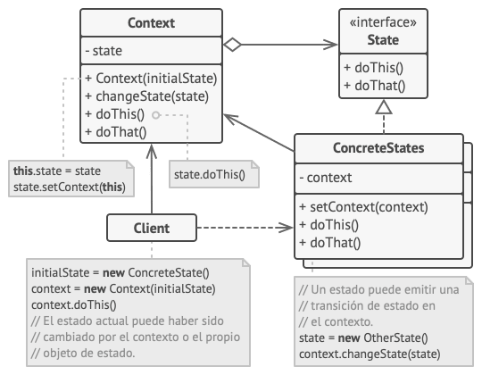

Figura 4. Diagrama de clases de la estructura del patrón de diseño estado.

## 3. Diseño e implementación

### 3.1 Hardware del sistema
En la figura 5 se presenta el diagrama en bloques del hardware del sistema. Se eligió la placa NUCLEO-F401RE como unidad central de procesamiento debido a que fue proporcionada por los docentes del curso y porque además es una placa con los recursos necesarios para implementar el sistema (incluso cuenta con más recursos de los necesarios). A su vez, representó la oportunidad de trabajar con una placa de desarrollo desconocida hasta ese momento. 
Para el ingreso de contraseña, se usó un teclado matricial genérico; el mismo es de membrana y está orientado al uso en prototipos. Para la detección de la apertura o cierre de la abertura, se empleó el uso de un sensor magnético; el mismo consiste en un interruptor tipo _reed_switch_, que invierte su estado si se encuentra bajo la influencia de un campo magnético. Para medir la distancia entre los marcos superior e inferior de la ventana se utilizó un sensor ultrasónico HC-SR04. Cabe destacar que la elección de componentes utilizados se basó en la disponibilidad del stock personal y el bajo costo de aquellos que se debieron adquirir (teclado matricial y conectores para protoboard).
Además, se dispuso alimentaciones individuales para la placa NUCLEO-F401RE y la placa *NodeMCU-32S* uniendo los terminales GND.
En la figura 6 se detallan las conexiones entre los pines de los dispositivos mostrados en la figura 5.

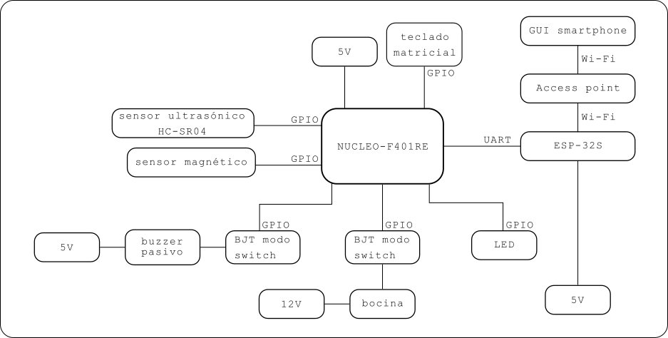

Figura 5. Diagrama en bloques del hardware del sistema


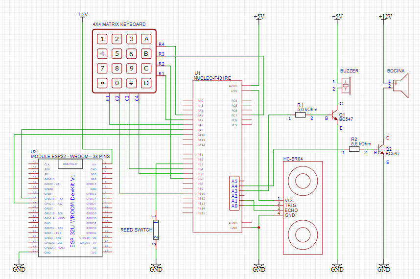

Figura 6. Diagrama esquemático del sistema.

En la tabla 7 se detallan las conexiones del sistema.

| N° de Conexión | Origen                | Pin origen  | Destino        | Pin destino |
| -------------- | --------------------- | ----------- | -------------- | ----------- |
| 1              | teclado matricial     | R1          | NUCLEO F401-RE | PA_7        |
| 2              | teclado matricial     | R2          | NUCLEO F401-RE | PB_6        |
| 3              | teclado matricial     | R3          | NUCLEO F401-RE | PC_7        |
| 4              | teclado matricial     | R4          | NUCLEO F401-RE | PA_6        |
| 5              | teclado matricial     | C1          | NUCLEO F401-RE | PA_8        |
| 6              | teclado matricial     | C2          | NUCLEO F401-RE | PB_10       |
| 7              | teclado matricial     | C3          | NUCLEO F401-RE | PB_4        |
| 8              | teclado matricial     | C4          | NUCLEO F401-RE | PB_5        |
| 9              | NodeMCU-32S           | GPIO16 (RX) | NUCLEO F401-RE | PA_9        |
| 10             | NodeMCU-32S           | GPIO17 (TX) | NUCLEO F401-RE | PA_10       |
| 11             | NodeMCU-32S           | GND         | Fuente 5V      | GND         |
| 12             | NodeMCU-32S           | Vin         | Fuente 5V      | +5V         |
| 13             | Interruptor magnético | 1           | NUCLEO F401-RE | PB_3        |
| 14             | Interruptor magnético | 2           | Fuente 5V      | GND         |
| 15             | HC-SR04               | VCC         | NUCLEO F401-RE | 5V          |
| 16             | HC-SR04               | TRIGGER     | NUCLEO F401-RE | PA_0 (A0)   |
| 17             | HC-SR04               | ECHO        | NUCLEO F401-RE | PA_1 (A1)   |
| 18             | HC-SR04               | GND         | Fuente 5V      | GND         |
| 19             | NUCLEO F401-RE        | GND         | Fuente 5V      | GND         |
| 20             | NUCLEO F401-RE        | PB_0 (A3)   | R1             | 1           |
| 21             | Q1                    | Base        | R1             | 2           |
| 22             | Q1                    | Emisor      | Fuente 5V      | GND         |
| 23             | Q1                    | Colector    | Buzzer         | 2           |
| 24             | Buzzer                | 1           | Fuente 5V      | +5V         |
| 25             | NUCLEO F401-RE        | PC_1 (A4)   | R2             | 1           |
| 26             | Q2                    | Base        | R2             | 2           |
| 27             | Q2                    | Emisor      | Fuente 12V     | GND         |
| 28             | Q2                    | Colector    | Bocina         | 2           |
| 29             | Bocina                | 1           | Fuente 12V     | +12V        |
| 30             | Fuente 12V            | GND         | Fuente 5V      | GND         |

Tabla 7. Conexiones del sistema

Por último, una tabla de materiales se presenta en la tabla 8. El costo de los componentes sin contar las placas de desarrollo es de $ 24.980,00 (USD 20,93 al tipo de cambio actual con fecha 06/10/2024). El costo total es de $122.990,00 (USD 102,92). Para un desarrollo similar se puede considerar el uso de un microcontrolador que tenga módulo Wi-Fi incorporado y demás recursos que ajusten a los necesarios para el presente trabajo sin excederlos y que sea de menor costo, para reducir el costo total del proyecto.

| Cantidad | Material          | Precio      |
| -------- | ----------------- | ----------- |
| 1        | NUCLEO-F401RE     | $ 90.000,00 |
| 1        | NodeMCU-32S       | $ 8.100,00  |
| 1        | HC-SR04           | $ 2.347,00  |
| 1        | Sensor magnético  | $ 2.300,00  |
| 1        | Teclado matricial | $ 1.763,00  |
| 1        | Bocina            | $ 10.980,00 |
| 1        | Buzzer pasivo     | $ 2.050,00  |
| 1        | BJT BC547         | $ 350,00    |
| 1        | LED               | $ 100,00    |
| 2        | Fuente 5 V        | $ 5.000,00  |

Tabla 8. Listado de materiales del sistema

### 3.2 Software del sistema

En la figura 7 se presenta los componentes de software del sistema, el cual cuenta con dos módulos: 'Alarm' y 'Wifi'. Se decidió limitar la cantidad de módulos a dos debido a que la estructura usada para el software consistió en el patrón de diseño estado, comentado en la sección "2.4.1 Estructura" y no se contaba con experiencia previa en el uso de patrones de diseño y poca experiencia en la programación orientada a objetos en C++. Por todo lo anterior, el tiempo y los esfuerzos estuvieron destinados a la comprensión de conceptos nuevos de la programación orientada a objetos y en lograr el correcto funcionamiento del sistema. Se pueden implementar mejoras a futuro que consistan en el uso de módulos para cada uno de los periféricos utilizados. 

En el archivo `main.cpp` se crean dos instancias de las clases 'Alarm' y 'Wifi' para crear sendos objetos de las máquinas de estado, como se puede visualizar en el fragmento 1. Mediante la máquina de estado 'Alarm' se controla el sensor ultrasónico, el buzzer, la bocina, el sensor magnético y el teclado matricial. Mediante la máquina de estado 'Wifi' se controla la placa *NodeMCU-32S*. Ambas máquinas de estado contienen métodos *getters* para obtener información relevante desde fuera de los objetos. De esta manera, desde el archivo `main.cpp` se consulta en cada ciclo de ejecución por el estado de ambas máquina de estados y cada 1000 ms se muestra información actual mediante el puerto serie de la PC. De manera similar, la máquina de estado 'Wifi' obtiene información de la máquina de estado 'Alarm' desde `main.cpp`, la cual es reenviada a la interfaz de usuario implementada mediante página web y visualizada en un smartphone mediante un navegador web. 

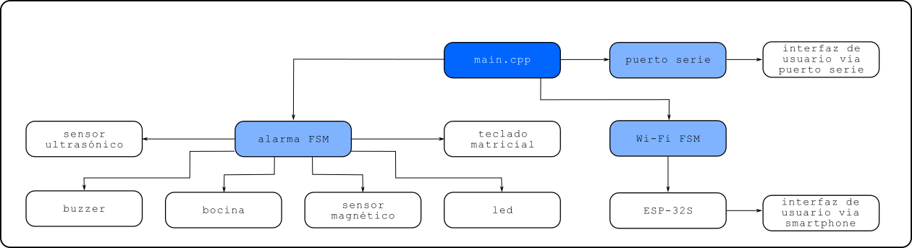

Figura 7. Diagrama de módulos de software


```c++
Alarm *alarm = new Alarm
(   &keypadRows, &keypadColumns,\
    ledPinForActivatingAndOnAlertStates, buzzerPin, hornPin,\
    triggerUltrasonicPin, echoUltrasonicPin, reedSwitchPin \
);

Wifi *wifi = new Wifi(&esp32uart);

int main(void)
{
    timerReport.start();
    double timerReportBegin = duration_cast<milliseconds>(timerReport.elapsed_time()).count();
    double timerReportCurrent;
    double timerReportElapsed;

    while (true) {
        timerReportCurrent = duration_cast<milliseconds>(timerReport.elapsed_time()).count();
        timerReportElapsed = timerReportCurrent - timerReportBegin;

        if (ttimerReportElapsed > 1000) {
            timerReportBegin = timerReportCurrent;
            updatePCReports(); //escribe en el puerto serie de la PC
        }

        alarm->run();
        wifi->run();

        updateWifiReports();
    }
}
```
Fragmento 1. Instanciación de máquinas de estado y detalle del super *loop*.

En el fragmento 2 se detalla la estructura de los archivos y ficheros del presente trabajo. Para ambas máquinas de estado se siguió una estructura similar, que se detalla en la tabla 8, siguiendo la guía que se mencionó en la sección "2.4.1 Estructura".

```
main.cpp
modules
|- FSM_alarm
  |- alarm_interface_client.cpp
  |- alarm_interface_client.h
  |- alarm_interface_state.h
  |- alarm_state_activating.cpp
  |- alarm_state_danger.cpp
  |- alarm_not_ready.cpp
  |- alarm_on_alert.cpp
  |- alarm_ready.cpp
  |- alarm_warning.cpp
  |- alarm_states.h
|- FSM_wifi
  |- wifi_interface_client.cpp
  |- wifi_interface_client.h
  |- wifi_interface_state.h
  |- wifi_state_cipclose_all.cpp
  |- wifi_state_cipclose.cpp
  |- wifi_state_cipmux.cpp
  |- wifi_state_cipsend.cpp
  |- wifi_state_cipserver.cpp
  |- wifi_state_cipstate.cpp
  |- wifi_state_cwjap.cpp
  |- wifi_state_send_html.cpp
  |- wifi_state_test.cpp
  |- wifi_state_wait.cpp
  |- wifi_states.h
```
Fragmento 2. Vista de árbol de los archivos del presente trabajo

| Archivo                         | Descripción                                                                                                                                                                                                         |
| :------------------------------ | :------------------------------------------------------------------------------------------------------------------------------------------------------------------------------------------------------------------ |
| ...interface_client.h           | Se incluyen librerías. Se declaran atributos y métodos públicos y privados.                                                                                                                                         |
| ...interface_client.cpp         | Se implementa el constructor de la clase. Se implementan métodos públicos y privados.                                                                                                                               |
| ...interface_state.h            | Interfaz de estado. Declara los todos métodos virtuales de todos los estados. Declara un puntero al objeto del contexto (en el presente trabajo renombrado a interfaz cliente).                                     |
| ..._states.h                    | Se declaran las clases de cada estado concreto. Cada clase hereda de la interfaz de estado y si es necesario declara atributos y métodos públicos y privados.                                                       |
| ..._state_nombre_del_estado.cpp | Un archivo '.cpp' por cada estado concreto. Se implementan los métodos heredados de la interfaz de estado. Si corresponde, se implementan los métodos públicos o privados declarados previamente en '..._states.h'. |

Tabla 9. Descripción de los archivos utilizados para implementar el patrón de diseño estado.

### 3.3 Implementación de conectividad *Wi-Fi*

Con el uso de la herramienta *ESP-AT* se implementó un servidor *TCP* en la placa *NodeMCU-32S*. En primer lugar se utilizó un convertidor USB-UART y la herramienta PuTTY para conectar la placa a un punto de acceso, usando como guía el capítulo 11 del libro de referencia del curso [3] y empleando los comandos que se listan en la tabla 7. Luego, desde la placa NUCLEO-F401RE se utilizaron los comandos AT listados en la tabla 8 para consultar si existieron solicitudes de conexión y responder las mismas mediante el envío de una página web con información sobre el sistema.

| Comando AT            | Función                                                 |
| --------------------- | ------------------------------------------------------- |
| AT+CWMODE=1           | Establece el modo estación del ESP32                    |
| AT+CWJAP="RED","PASS" | Conecta la placa ESP32 a un punto de acceso determinado |
| AT+CIFSR              | Obtiene la dirección IP local y la dirección MAC        |

Tabla 10. Comandos AT utilizados para configurar la placa *NodeMCU-32S* en modo servidor TCP.

| Comando AT                 | Función                                                       |
| -------------------------- | ------------------------------------------------------------- |
| AT+CWJAP?                  | Consulta a cuál punto de acceso está conectada la placa ESP32 |
| AT+CIPMUX=1                | Habilita el modo de conexiones múltiples[6]                   |
| AT+CIPSERVER=1,80          | Crea un servidor TCP en el puerto 80                          |
| AT+CIPSTATE?               | Consulta las conexiones activas                               |
| AT+CIPSEND=\<ID\>,\<size\> | Envía datos                                                   |
| AT+CIPCLOSE=\<ID\>         | Termina una conexión activa con un ID en particular           |
| AT+CIPCLOSE=5              | Termina todas las conexiones activas                          |

Tabla 11. Comandos AT utilizados para establecer la comunicación entre la placa NUCLEO-F401RE y la interfaz de usuario a través del servidor TCP implementado en la placa *NodeMCU-32S*.

### 3.4 Variables y objetos

En la tabla 12 se detallan las funciones utilizadas por el archivo principal `main.cpp`.

| Encabezado                 | Funcionalidad                                                                                                                                                                                                                                                                                                                                    |
| -------------------------- | ------------------------------------------------------------------------------------------------------------------------------------------------------------------------------------------------------------------------------------------------------------------------------------------------------------------------------------------------ |
| `void updatePCReports()`   | Asigna texto a la variable *string* `messageToWriteOnPC` con información de las máquinas de estado 'alarm' y 'wifi'. Luego escribe en el puerto serie de la PC el contenido de dicha variable.                                                                                                                                                   |
| `void updateWifiReports()` | Obtiene reportes de la máquina de estados 'alarm' mediante los métodos *getters* de esa máquina. Luego, establece los reportes de alarma mediante sus propios métodos *setters* con información del estado actual, del sensor magnético y ultrasónico y del sistema en general. Por ejemplo `wifi->setAlarmStateReport(alarm->getStateReport())` |

Tabla 12. Funciones globales utilizadas por `main.cpp`.

En las tablas 13 y 14 se detallan los métodos públicos y privados respectivamente empleados por la clase 'Alarm'.

| Encabezado                                      | Funcionalidad                                                                                                                                                                                                                                                            |
| ----------------------------------------------- | ------------------------------------------------------------------------------------------------------------------------------------------------------------------------------------------------------------------------------------------------------------------------ |
| `void setState(AlarmStateInterface *state)`     | Borra la referencia hacia el objeto del estado concreto y establece una nueva referencia hacia el objeto del estado pasado como parámetro. Envía a ese objeto una una referencia hacia él mismo (el objeto contexto le pasa su referencia al objeto del estado concreto) |
| `void TransitionTo(AlarmStateInterface *state)` | Establece un nuevo estado, usando el método `setState` y llama al método `entry` de ese estado concreto (donde se ejecutan acciones una sola vez durante el tiempo en el que el programa se encuentre en ese estado).                                                    |
| `void run()`                                    | Llama al método `entry` de ese estado concreto (donde se ejecutan acciones una sola vez durante el tiempo en el que el programa se encuentre en ese estado).                                                                                                             |
| `void stop()`                                   | Elimina la referencia al estado concreto.                                                                                                                                                                                                                                |
| `void startMainTimer()`                         | Inicia el reloj de la máquina de estado.                                                                                                                                                                                                                                 |
| `void stopMainTimer()`                          | Detiene el reloj de la máquina de estado.                                                                                                                                                                                                                                |
| `void resetMainTimer()`                         | Reinicia el reloj de la máquina de estado.                                                                                                                                                                                                                               |
| `double readMainTimer()`                        | Devuelve el tiempo en milisegundos del reloj de la máquina de estado.                                                                                                                                                                                                    |
| `int getRowIndexValue()`                        | Devuelve el valor correspondiente al número de fila activo del teclado matricial.                                                                                                                                                                                        |
| `void incrementRowIndexValue()`                 | Incrementa en 1 el valor correspondiente al número de fila activo del teclado matricial.                                                                                                                                                                                 |
| `void setRowValue(int index, int value)`        | Escribe en uno de los pines conectado al teclado matricial, de acuerdo al índice y valor booleano tomados como parámetros.                                                                                                                                               |
| `int getColumnValue(int index)`                 | Lee uno de los pines conectado al teclado matricial, de acuerdo al índice tomado como parámetro.                                                                                                                                                                         |
| `char getKey(int row, int col)`                 | Realiza la conversión al carácter correspondiente según la fila y columna tomada como parámetro. Por ejemplo la fila 0 y columna 0 corresponde al caracter '1'.                                                                                                          |
| `void setAccess(bool value)`                    | Establece una variable booleana privada `accessGranted_`,que representa el acceso concedido para activar o desactivar el sistema.                                                                                                                                        |
| `bool getAccess()`                              | Lee el valor de la variable booleana privada `accessGranted_`, que representa el acceso concedido para activar o desactivar el sistema.                                                                                                                                  |
| `bool checkIfPasswordEnteredIsCorrect()`        | Compara un array privado de 4 elementos char que contiene la contraseña del sistema con el un array privado de 4 elementos char correpondiente a la clave ingresada mediante teclado matricial.                                                                          |
| `void resetPasswordEntered()`                   | Reestablece la contraseña ingresada colocando el carácter '0' en todos los elementos del array.                                                                                                                                                                          |
| `void resetIndexPassEntered()`                  | Establece en 0 el índice utilizado para recorrer el array de la contraseña del sistema.                                                                                                                                                                                  |
| `void storePasswordEntered(char pressedKey)`    | Almacena en un array privado de 4 elementos char los caracteres ingresados mediante el teclado matricial y su posterior conversión de fila-columna a carácter.                                                                                                           |
| `void toggleBuzzerValueAndWriteOnIt()`          | Invierte el valor booleano correspondiente al estado actual del buzzer y escribe en el pin de salida conectado a él.                                                                                                                                                     |
| `void setBuzzerValueAndWriteOnIt(int value)`    | Establece un valor booleano y escribe en el pin de salida conectado al buzzer.                                                                                                                                                                                           |
| `void turnOnHorn()`                             | Escribe un '1' lógico en el pin de salida conectado a a la bocina.                                                                                                                                                                                                       |
| `void turnOffHorn()`                            | Escribe un '0' lógico en el pin de salida conectado a a la bocina.                                                                                                                                                                                                       |
| `double getDistanceMeasured()`                  | devuelve el valor de la variable privada `distanceMeasured_` que representa la distancia medida por el sensor ultrasónico.                                                                                                                                               |
| `int readReedSwitchValue()`                     | Lee el valor del pin asociado al sensor magnético.                                                                                                                                                                                                                       |
| `void toggleAlertLedValueAndWriteOnIt()`        | Invierte el valor booleano correspondiente al estado actual del LED de alerta y escribe en el pin de salida conectado a él. En el presente trabajo no se implementó dicho LED, pero se utilizó para pruebas para reemplazar al sonido de la bocina durante ellas.        |
| `void setAlertLedValueAndWriteOnIt(int value)`  | Establece un valor booleano y escribe en el pin de salida conectado al LED de alerta. En el presente trabajo no se implementó dicho LED, pero se utilizó para pruebas para reemplazar al sonido de la bocina durante ellas.                                              |
| `void setSystemReport(string value)`            | Establece un *string* con un mensaje representativo del sistema en general                                                                                                                                                                                               |
| `string getSystemReport()`                      | Devuelve un *string* con un mensaje representativo del sistema en general                                                                                                                                                                                                |
| `void setStateReport(string value)`             | Establece un *string* con el estado activo.                                                                                                                                                                                                                              |
| `string getStateReport()`                       | Devuelve un *string* con el estado activo.                                                                                                                                                                                                                               |
| `void setReedSwitchReport(string value)`        | Establece un *string* con el estado del sensor magnético.                                                                                                                                                                                                                |
| `string getReedSwitchReport()`                  | Devuelve un *string* con el estado del sensor magnético.                                                                                                                                                                                                                 |
| `void setUltrasonicSensorReport(string value)`  | Establece un *string* con el estado del sensor ultrasónico                                                                                                                                                                                                               |
| `string getUltrasonicSensorReport()`            | Devuelve un *string* con el estado del sensor ultrasónico.                                                                                                                                                                                                               |
| `void deleteAllReports()`                       | Emplea los métodos `setSystemReport`, `setStateReport`, `setReedSwitchReport` y `setUltrasonicSensorReport` para establecer un *string* vacío en cada uno de los reportes respectivos de la máquina.                                                                     |

Tabla 13. Métodos públicos de la clase 'Alarm'.

| Encabezado                     | Funcionalidad                                                                                                                                                                                                                                          |
| ------------------------------ | ------------------------------------------------------------------------------------------------------------------------------------------------------------------------------------------------------------------------------------------------------ |
| `void firesUltrasonicBurst_()` | Escribe un '1' lógico en el pin de salida conectado al pin 'trigger' del sensor ultrasónico, dando inicio a una ráfaga de ultrasonidos. Vincula a un objeto `Timeout` el método privado `void stopUltrasonicBurst_()` para ser llamado luego de 10 us. |
| `void stopUltrasonicBurst_()`  | Escribe un '0' lógico en el pin de salida conectado al pin 'trigger' del sensor ultrasónico, deteniendo la ráfaga de ultrasonidos.                                                                                                                     |
| `void echoRise_()`             | Método que se vincula al método `rise` del objeto `InterruptIn` asociado al pin 'echo' del sensor ultrasónico.                                                                                                                                         |
| `void echoFall_()`             | Método que se vincula al método `fall` del objeto `InterruptIn` asociado al pin 'echo' del sensor ultrasónico.                                                                                                                                         |

Tabla 14. Métodos privados de la clase 'Alarm'.


En las tablas 15 se detallan los métodos públicos y privados respectivamente empleados por la clase 'Wifi'.

| Encabezado                                          | Funcionalidad                                                                                                                                                                                                                                                            |
| --------------------------------------------------- | ------------------------------------------------------------------------------------------------------------------------------------------------------------------------------------------------------------------------------------------------------------------------ |
| `void setState(AlarmStateInterface *state)`         | Borra la referencia hacia el objeto del estado concreto y establece una nueva referencia hacia el objeto del estado pasado como parámetro. Envía a ese objeto una una referencia hacia él mismo (el objeto contexto le pasa su referencia al objeto del estado concreto) |
| `void TransitionTo(AlarmStateInterface *state)`     | Establece un nuevo estado, usando el método `setState` y llama al método `entry` de ese estado concreto (donde se ejecutan acciones una sola vez durante el tiempo en el que el programa se encuentre en ese estado).                                                    |
| `void run()`                                        | Llama al método `entry` de ese estado concreto (donde se ejecutan acciones una sola vez durante el tiempo en el que el programa se encuentre en ese estado).                                                                                                             |
| `void stop()`                                       | Elimina la referencia al estado concreto.                                                                                                                                                                                                                                |
| `void startMainTimer()`                             | Inicia el reloj de la máquina de estado.                                                                                                                                                                                                                                 |
| `void stopMainTimer()`                              | Detiene el reloj de la máquina de estado.                                                                                                                                                                                                                                |
| `void resetMainTimer()`                             | Reinicia el reloj de la máquina de estado.                                                                                                                                                                                                                               |
| `double readMainTimer()`                            | Devuelve el tiempo en milisegundos del reloj de la máquina de estado.                                                                                                                                                                                                    |
| `void writeOnWiFiSerialPort()`                      | Escribe un mensaje en el puerto serie que se conecta con la placa ESP-WROOM-32S mediante UART.                                                                                                                                                                           |
| `string concatenateStringsToSendToGUI()`            | Devuelve un texto escrito en HTML con información sobre el objeto 'alarma', para ser enviado a la placa ESP-WROOM-32S.                                                                                                                                                   |
| `size_t calculateSizeOfHTMLMessage()`               | Devuelve el tamaño del *string* a enviar a la placa ESP-WROOM-32S.                                                                                                                                                                                                       |
| `void setWifiSystemReport(string value)`            | Establece un *string* con un mensaje representativo del sistema en general.                                                                                                                                                                                              |
| `void getWifiSystemReport(string value)`            | Devuelve un *string* con un mensaje representativo del sistema en general.                                                                                                                                                                                               |
| `void setWifiStateReport(string value)`             | Establece un *string* con el estado actual de la máquina.                                                                                                                                                                                                                |
| `void getWifiStateReport(string value)`             | Devuelve un *string* con el estado actual de la máquina.                                                                                                                                                                                                                 |
| `void setAlarmSystemReport(string value)`           | Establece un *string* con un mensaje representativo del sistema en general de la máquina 'alarm'.                                                                                                                                                                        |
| `string getAlarmSystemReport()`                     | Devuelve un *string* con un mensaje representativo del sistema en general de la máquina 'alarm'.                                                                                                                                                                         |
| `void setAlarmStateReport(string value)`            | Establece un *string* con el estado activo de la máquina 'alarm'.                                                                                                                                                                                                        |
| `string getAlarmStateReport()`                      | Devuelve un *string* con el estado activo de la máquina 'alarm'.                                                                                                                                                                                                         |
| `void setAlarmReedSwitchReport(string value)`       | Establece un *string* con el estado del sensor magnético de la máquina 'alarm'.                                                                                                                                                                                          |
| `string getAlarmReedSwitchReport()`                 | Devuelve un *string* con el estado del sensor magnético de la máquina 'alarm'.                                                                                                                                                                                           |
| `void setAlarmUltrasonicSensorReport(string value)` | Establece un *string* con el estado del sensor ultrasónico de la máquina 'alarm'.                                                                                                                                                                                        |
| `string getAlarmUltrasonicSensorReport()`           | Devuelve un *string* con el estado del sensor ultrasónico de la máquina 'alarm'.                                                                                                                                                                                         |
| `void deleteWifiReportsOnly()`                      | Establece un *string* vacío en cada uno de los reportes respectivos de la máquina Wifi.                                                                                                                                                                                  |

Tabla 15. Métodos públicos de la clase 'Wifi'.

### 3.5 Interfaz de usuario web

En la figura se muestra la interfaz de usuario implementada en archivo html y renderizada mediante un navegador web.

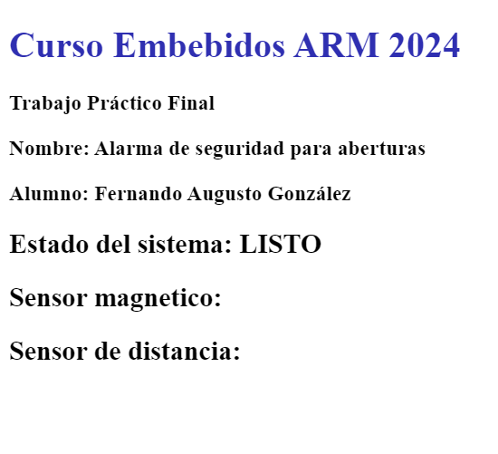

Figura 8. Ejemplo de pantalla de interfaz de usuario visualizada mediante navegador web.

Se eligió un diseño simple que muestre el estado de los sensores magnético y ultrasónico, así como el estado actual de la máquina de estados 'alarm'. La interfaz es de sólo lectura, es decir no posee interactividad con el usuario. Además se incluyó una etiqueta meta, mostrada en el fragmento 3, para que el navegador refresque automáticamente la página cada 5 segundos. Se eligió ese tiempo en base a pruebas en las que se consideró que era un periodo apropiado para que, una vez que el servidor TCP termine de enviar el archivo html y cierre la conexión, el navegador pueda enviar una nueva solicitud de conexión al servidor TCP. 

```html
<meta http-equiv=\"refresh\" content=\"5\" />
```
Fragmento 3. Etiqueta meta utilizada para refrescar la página web automáticamente cada 5 segundos.

### 3.6 Máquinas de estados
En el presente trabajo se implementó dos máquinas de estado, "alarm" y "wifi", siguiendo la guía mencionada en la la sección "2.4.1 Estructura" y la estructura de archivos detallada en la sección "3.2 Software del sistema". En cada uno de los estados de ambas máquinas, se implementan al menos tres métodos comunes a todos los estados: `entry()`, `inState()` y `exit()`. Luego, de acuerdo a la necesidad, se implementan otros métodos adicionales para añadir funcionalidad a un determinado estado. Los métodos mencionados cumplen diferentes roles dentro de un mismo estado:
- `entry()`: Se establece este método para ejecutar instrucciones una sola vez y al ingresar al estado. 
- `inState()`: Se implementa este método para ejecutar instrucciones mientras el programa se encuentre en un determinado estado dentro de un esquema *super loop* en `main.cpp`. Es decir que las instrucciones dentro de `inState()` se ejecutarán en bucle también.
- `exit()`: Se establece este método para ejecutar instrucciones una sola vez y al egresar del estado.
El uso de métodos `entry()` y `exit()` depende del diseño. Dentro de ellos se agregan instrucciones de ser necesarios o sino se dejan vacíos (excepto `entry()` que al menos debe llamar a `inState()`). En cambio el método `inState()` se implementa siempre, teniendo en cuenta que desde `main.cpp` se llamará continuamente al método `run()` de cada máquina de estado, como se puede observar en el Fragmento 1. Luego, dentro de `run()`, se llama al método `entry()` para ejecutar instrucciones una vez y en el siguiente ciclo, al llamar a `entry()` se llama a `inState()` en cada ciclo.

#### 3.6.1 Máquina de estado alarma

Para satisfacer los requisitos relativos al sistema de alarma, en el presente trabajo se implementó la máquina de estados 'alarm'. En la figura 9 se muestra el diagrama de estados correspondiente con las partes más significativas por cuestiones de diseño gráfico. Como se puede apreciar en dicha figura, en todos los estados se establece un reporte de estado al ingresar al estado. De esta manera el módulo externo encargado de la interfaz de usuario puede obtener el estado actualizado del sistema. Luego, al salir de cada estado se borran los reportes para limpiar los mensajes antes de iniciar la transición al siguiente estado.
En cuanto al funcionamiento de la máquina, el sistema inicia ingresando en el estado 'NOT READY', estado en el que permanecerá si el sensor magnético detecta que la abertura se encuentra abierta o si el sensor ultrasónico detecta un obstáculo en su camino. Si la abertura se encuentra cerrada y si además el sensor ultrasónico no detecta un obstáculo en su zona de detección, la máquina transiciona al estado 'READY'. En el estado 'READY' la acción más relevante consiste en leer el teclado matricial y comparar la contraseña ingresada con una contraseña guardada. Si en cualquier momento la precondición de los sensores cambia, la máquina regresa al estado 'NOT READY', pero si se ingresa una contraseña y resulta ser la correcta, la máquina transiciona al estado 'ACTIVATING'. En el estado 'ACTIVATING' se establece un tiempo de espera antes de transicionar al estado 'ON ALERT', para que el usuario pueda salir de la casa.
Una vez que la máquina se encuentra en el estado 'ON ALERT', puede volver al estado 'READY' si se ingresa la contraseña correcta, también puede transicionar a 'DANGER' si la abertura es abierta o puede transicionar a 'WARNING' si el sensor ultrasónico detecta un obstáculo en su zona de detección. Dentro del estado 'WARNING', el buzzer emite sonidos intermitentes con un periodo de 1000 ms. Cuando el obstáculo desaparece dentro de un periodo de 30 segundos, la máquina regresa al estado 'ON ALERT'. Pero si el obstáculo permanece más de 30 segundos, la máquina transiciona al estado 'DANGER', el buzzer se apaga y la bocina se enciende. Por otro lado, si la máquina se encuentra en el estado 'ON ALERT' y la abertura se abre, la máquina transiciona a 'DANGER' y la bocina se enciende. La máquina permanece en 'DANGER' a menos que se interrumpa la alimentación o si el usuario ingresa la contraseña correcta. En el último caso, la máquina transiciona a 'NOT READY' completando el ciclo de funcionamiento.
Por cuestiones de simplicidad, en la figura 9 se resume la lectura del teclado matricial bajo la leyenda `readMatrixKeypad()` en el estado 'READY. Para mayor detalle, esa funcionalidad se muestra en el fragmento 4.

```c++
if (elapsedMainTime_ > kMatrixKeypadReadingPeriod){// in milliseconds
        startMainTime_ = currentMainTime_;

        for(int i=0;i<=3;i++) { //Write 0 in one row for enable it and 1 in the others to disable them

            if (i == this->alarm_->getRowIndexValue()) {
                this->alarm_->setRowValue(i, 0);
            } else {
                this->alarm_->setRowValue(i, 1);
            }
        }

        for(int i=0;i<=3;i++) { // Read columns sequentially

            if (this->alarm_->getColumnValue(i) == 0) {
                char temp_keyPressed = this->alarm_->getKey(this->alarm_->getRowIndexValue(),i);

                if (temp_keyPressed != 'A') {
                    this->alarm_->storePasswordEntered(temp_keyPressed); //store pressed key in the array
                    this->alarm_->setSystemReport("");
                } else {
                    if (this->alarm_->checkIfPasswordEnteredIsCorrect() == true) {
                        this->alarm_->setAccess(true);
                        this->alarm_->setSystemReport("CONTRASEÑA CORRECTA");
                    } else {
                        this->alarm_->setSystemReport("CONTRASEÑA INCORRECTA");
                        this->alarm_->resetIndexPassEntered();
                    }
                }
            }
        }

        this->alarm_->incrementRowIndexValue();
        this->exit();
    }
```
Fragmento 4. Implementación de la lectura del teclado matricial.

De manera similar, lo que en la figura 9 se lee bajo las leyendas `updateUltrasonicReport()` y `updateReedSwitchReport()` del estado 'NOT READY', se detalla en el fragmento 5.
```c++
if (getDistanceMeasured() < kWarningDistance) {
    setUltrasonicSensorReport("Obstáculo detectado");
} else {
    setUltrasonicSensorReport("Despejado");
}

if (readReedSwitchValue() == kReedSwitchValueWhenIsOpened) {
    this->alarm_->setReedSwitchReport("Ventana abierta");
} else {
    this->alarm_->setReedSwitchReport("Ventana cerrada");
}
```
Fragmento 5. Implementación de la actualización de los reportes del sensor ultrasónico y magnético.


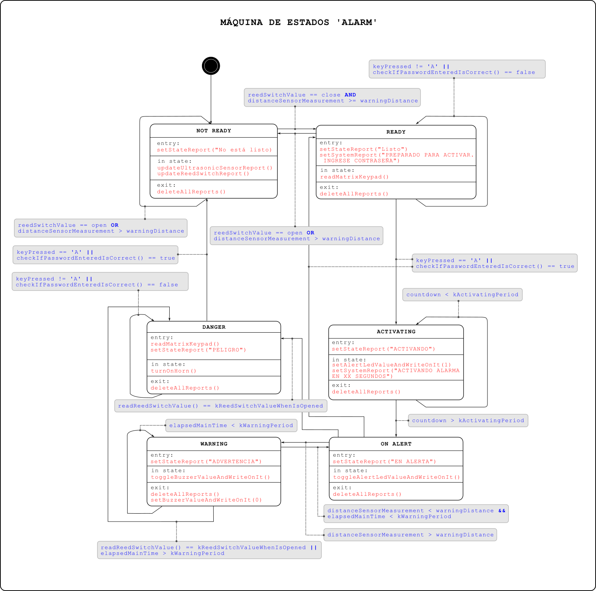

Figura 9. Diagrama de máquina de estados del sistema 'alarm'. El texto en negrita corresponde a los nombres de los estados. El texto en color azul corresponde a las condiciones de transición, el color rojo corresponde a las salidas.

#### 3.6.2 Máquina de estado Wi-Fi

Antes de conectar la placa *NodeMCU-32S* al sistema, se conectó la placa a un punto de acceso mediante el software PuTTY como se describió en la sección "3.3 Implementación de conectividad Wi-Fi". Luego, se utilizó una máquina de estados para enviar comandos AT desde la placa NUCLEO-F401RE a modo de MCU manager. En la figura 10 se muestra el diagrama de máquina de estados del sistema 'wifi', que por cuestiones de diseño gráfico se muestran las partes más significativas solamente.
Teniendo la placa conectada a un punto de acceso previamente, desde la placa NUCLEO-F401RE se inicia la máquina de estados desde el estado 'CWJAP' en donde se envía el comando de consulta `AT+CWJAP?`. Se eligió este comando debido a que en la documentación del fabricante [7], el comando `AT+CIPSTATUS` se encontró etiquetado como obsoleto junto con la recomendación de usar en su lugar `AT+CWJAP?`. Una vez que la herramienta ESP-AT responde correctamente, la máquina transiciona al estado 'CIPMUX', en donde se configura la placa para que admita múltiples conexiones, para poder luego implementar un servidor TCP mediante el estado 'CIPSERVER'.
Una vez configurado el servidor TCP, la máquina queda esperando una solicitud de conexión. Cuando se recibe una solicitud de conexión, el mensaje recibido es similar al que se muestra en el fragmento 6. En ese momento la herramienta ESP-AT puede aceptar o rechazar la conexión y, en caso de aceptarla, le asigna una identificación (ID) automática. Por ello, en el estado 'WAIT' se analiza si la respuesta recibida contiene la cadena ", CONNECT" para decidir si transicionar al estado 'CIPSTATE' y actualizar el listado de conexiones o quedarse esperando un mensaje de solicitud de conexión.

```
0,CONNECT

+IPD,0,473:GET / HTTP/1.1
Host: 192.168.0.138
Connection: keep-alive
Cache-Control: max-age=0
Upgrade-Insecure-Requests: 1
User-Agent: Mozilla/5.0 (Windows NT 10.0; Win64; x64) AppleWebKit/537.36 (KHTML, like Gecko) Chrome/129.0.0.0 Safari/537.36
Accept: text/html,application/xhtml+xml,application/xml;q=0.9,image/avif,image/webp,image/apng,*/*;q=0.8,application/signed-exchange;v=b3;q=0.7
Accept-Encoding: gzip, deflate
Accept-Language: es-419,es;q=0.9,en;q=0.8,pt;q=0.7
```
Fragmento 6. Ejemplo de mensaje recibido cuando un dispositivo accede a la dirección IP asignada a la placa *NodeMCU-32S*. Se destaca la primer línea "0,CONNECT", en donde el primer dígito corresponde a la identificación automáticamente asignada.

Como se detalla en el fragmento 7, desde el estado 'WAIT' se puede transicionar al estado CIPSEND aparte del estado 'CIPSTATE' si es que existen conexiones activas guardadas que se encuentren esperando una respuesta. También, para prevenir de que existan conexiones sin responder, la máquina transiciona automáticamente a 'CIPSTATE' para renovar el listado de conexiones, debido a que la herramienta ESP-AT asigna y cierra conexiones automáticamente aparte de los comandos enviados desde la placa NUCLEO-F401RE.

```c++
void WAIT::exit()

{
    if (this->indexOfTheFirstWordToSearchFor != std::string::npos) {  
        this->wifi_->TransitionTo(new CIPSTATE);
    } else if (this->ThereIsAnyConnectionAlive() == true) {
        this->wifi_->TransitionTo(new CIPSEND);
    } else {
        this->wifi_->countdownForWaitState--;
        if (this->wifi_->countdownForWaitState <= 0) {
            this->wifi_->countdownForWaitState = 10;
            this->wifi_->TransitionTo(new CIPSTATE);
        } else {
           this->wifi_->TransitionTo(new WAIT);
        }
    }
}
```
Fragmento 7. Transiciones desde el estado 'WAIT' hacia los estados 'CIPSTATE', 'CIPSEND' y reingreso al mismo estado. En primer lugar se evalúa si el string utilizado como buffer contiene la cadena ",CONNECT", luego si existe alguna conexión activa guardada. Por último se vuelve a estado 'WAIT' durante 10 ciclos para luego renovar el listado de conexiones mediante la transición al estado 'CIPSTATE'.

En el estado 'CIPSTATE' se analiza el *string* recibido como respuesta ante el comando 'AT+CIPSTATE?' en busca de las identificaciones de conexión. Un ejemplo de dicha respuesta se presenta en el fragmento 8. De haber conexiones, éstas son almacenadas en un array para poder enviar los archivos *HTML* a cada una de ellas en el estado 'CIPSEND'.

```
AT+CIPSTATE?
+CIPSTATE:0,"TCP","192.168.0.106",55747,80,1
+CIPSTATE:1,"TCP","192.168.0.106",55748,80,1
+CIPSTATE:2,"TCP","192.168.0.156",52084,80,1
+CIPSTATE:3,"TCP","192.168.0.206",45888,80,1
+CIPSTATE:4,"TCP","192.168.0.206",58558,80,1

OK
```
Fragmento 8. Ejemplo de respuesta de la herramienta ESP-AT ante el comando `AT+CIPSTATE?`. Se observan 5 dispositivos conectados, el máximo número de conexiones permitidas.

Una vez que la máquina se encuentra en el estado 'CIPSEND', se espera recibir como respuesta correcta 'OK' y luego '>', de manera que la herramienta ESP-AT quede a la espera del envío del archivo *HTML*. De ser así, la máquina transiciona al estado 'SENDHTML', en donde se envía el archivo *HTML* que contiene los datos de la máquina de estados 'alarm' obtenida mediante métodos getters de 'alarm'.
La leyenda `attempsTosend()` del estado 'SENDHTML' se refiere a la lógica mostrada en el fragmento 9 donde, sino se pudo enviar correctamente el archivo *HTML*, se intenta volver a enviar en total 3 veces, volviendo al método `inState()` sin salir del estado (esto es, sin ejecutar el método `entry()`. Luego de agotar los intentos la máquina transiciona al estado 'CIPCLOSE'. Existe un caso similar con respecto a la leyenda `attempsToClose()` en la transición entre los estados 'CIPCLOSE' y 'CIPCLOSEALL'.

```c++
void SENDHTML::exit()

{
    if (this->indexOfTheFirstWordToSearchFor != std::string::npos) {  
        this->wifi_->TransitionTo(new CIPCLOSE);
    } else {
        this->attemps_--;
        if (this->attemps_ <= 0) {
            this->wifi_->TransitionTo(new CIPCLOSE);
        } else {
            this->inState();
        }
    }
}
```
Fragmento 9. Implementación de intentos de envío del archivo HTML. En primer lugar se evalúa si dentro del string usado como buffer se detecta la respuesta 'SEND OK', si es así la máquina transiciona al estado 'CIPCLOSE'; sino se descuenta una variable entera `attemps_` y se vuelve a ejecutar el método `inState()` a menos que se agoten los intentos, caso en el cual la máquina transiciona al estado 'CIPCLOSE'.

Cuando finaliza el envío del archivo HTML y la herramienta ESP-AT responde 'SEND OK', la máquina transiciona al estado 'CIPCLOSE' para cerrar dicha conexión, de manera de comunicar a la herramienta ESP-AT que no se enviará más información. En este estado se espera recibir 'ID, CLOSED' como respuesta correcta (donde 'ID' corresponde al caracter de la conexión), para luego efectuar una transición al estado 'WAIT' y finalizar el ciclo de funcionamiento. En en caso de recibir una respuesta errónea y habiendo agotado al menor 3 intentos de cierre como se mencionó previamente en el caso similar comentado respecto al fragmento 9, la máquina transiciona al estado 'CIPCLOSEALL' para forzar el cierre de la conexión. Esto se logra mediante el envío del comando 'AT+CIPCLOSE=5', teniendo en cuenta que se cierran todas las conexiones activas. Luego del estado 'CIPCLOSEALL' la máquina transiciona al estado 'WAIT' quedando a la espera de una nueva conexión.

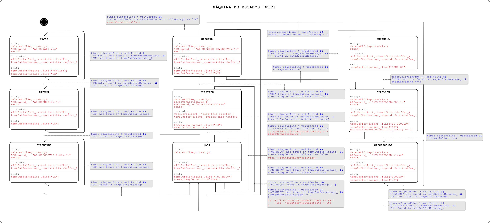

Figura 10. Diagrama de máquina de estados del sistema 'wifi'. El texto en negrita corresponde a los nombres de los estados. El texto en color azul corresponde a las condiciones de transición, el color rojo corresponde a las salidas. Se considera `waitPeriod = 1000 ms`.

## Capítulo 4. Ensayos y resultados.

### 4.1 Pruebas funcionales

En el presente trabajo se realizaron pruebas de funcionamiento utilizando las conexiones detalladas en la figura 6 "Diagrama esquemático del sistema" de la sección "3.1 Hardware del sistema" y utilizando el firmware descripto en la sección "3.2 Software del sistema" cuyo enlace al repositorio se encuentra en [8]. En la figura 11 y 12 se muestran imágenes tomadas el día de la prueba realizada. Asimismo en la sección 6 "Enlaces" se dispone el enlace al video [9] de demostración del presente trabajo.

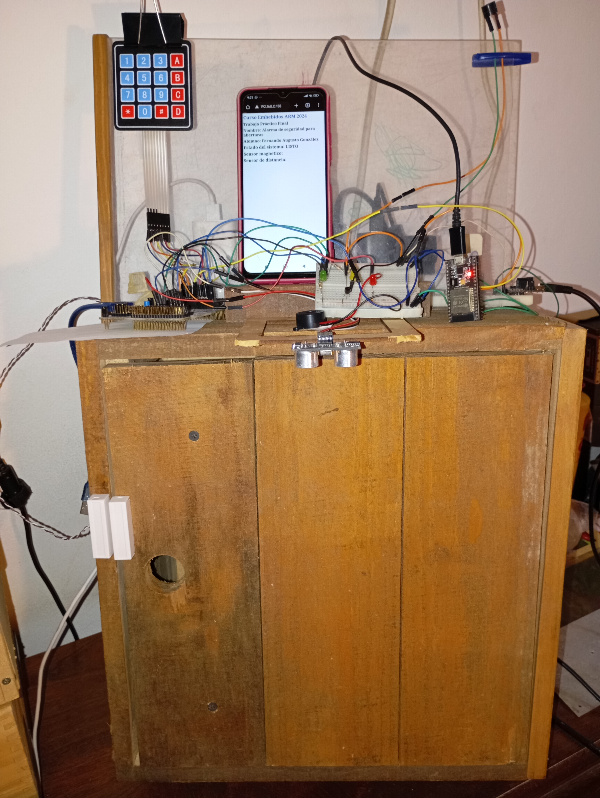

Figura 11. Vista frontal del sistema probado. Se observa una caja de madera funcionando como abertura de prueba en la que se dispuso un sensor magnético.

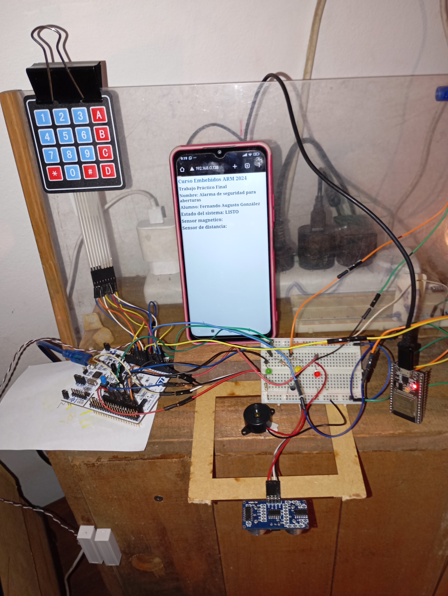

Figura 12. Vista superior del sistema probado. A la izquierda y centro se observa la placa NUCLEO-F401RE. A la izquierda y abajo se observa el sensor magnético. A la izquierda y arriba el teclado matricial. En el centro el smartphone con la interfaz de usuario, se observa la dirección IP "192.168.0.138". En el centro también se observa un buzzer en reemplazo de la sirena, el sensor ultrasónico y una protoboard con tres leds, resistencias y el transistor bipolar. A la derecha y al centro se observa la placa *NodeMCU-32S*. Por último a la derecha y arriba se observa el buzzer de advertencia. 

### 4.2 Cumplimiento de requisitos
Se probó todos los casos de uso del 1 al 4, descriptos en la sección 2.2 "Casos de uso". La prueba resultó exitosa en todos los casos. Además se comprobó el cumplimiento de los requisitos de la tabla 2 de la sección 2.1 "Requisitos", según se muestra en la tabla 16. 

| Grupo             | Id  | Descripción                                                                                                                                                                                                                                                                                                                                                                                                                      | Cumplido? |
| ----------------- | --- | -------------------------------------------------------------------------------------------------------------------------------------------------------------------------------------------------------------------------------------------------------------------------------------------------------------------------------------------------------------------------------------------------------------------------------- | --------- |
| 1. LED            | 1.1 | Debe encenderse cuando la alarma está activa                                                                                                                                                                                                                                                                                                                                                                                     | Sí        |
|                   | 1.2 | Debe apagarse cuando la alarma está inactiva                                                                                                                                                                                                                                                                                                                                                                                     | Sí        |
|                   | 1.3 | Debe titilar cuando el usuario esté ingresando una contraseña y volver a su estado anterior en caso de contraseña incorrecta. Esto es, debe apagarse el LED si el usuario quiere activar el sistema pero ingresa una contraseña incorrecta o se agota el tiempo de espera o debe encenderse el LED si el sistema está activo y el usuario quiere desactivarlo e ingresa una contraseña incorrecta o se agota el tiempo de espera | No        |
| 2. NUCLEO F401RE  | 2.1 | Debe solicitar una contraseña de 4 dígitos para activar/desactivar el sistema que se ingresará mediante el teclado matricial                                                                                                                                                                                                                                                                                                     | Sí        |
|                   | 2.2 | Debe tener un tiempo límite de espera de 30 segundos para desactivar la alarma                                                                                                                                                                                                                                                                                                                                                   | No        |
|                   | 2.3 | Debe esperar treinta segundos para activar la alarma una vez que se ingresa la contraseña correcta. Esto es con la intención de brindar la posibilidad al usuario de salir de la casa antes de que el sistema se active.                                                                                                                                                                                                         | Sí        |
|                   | 2.4 | Debe establecer un estado de advertencia mientas el sensor ultrasónico arroje una medición inferior a la altura del marco de la ventana con una tolerancia de ±5% de esa longitud                                                                                                                                                                                                                                                | Sí        |
|                   | 2.5 | Debe establecer un estado de alarma si el estado de advertencia permaneció activo durante más de 30 segundos                                                                                                                                                                                                                                                                                                                     | Sí        |
|                   | 2.6 | Debe establecer un estado de alarma si se separó el par de contactos magnéticos y el sistema está activo                                                                                                                                                                                                                                                                                                                         | Sí        |
| 3. Buzzer 1       | 3.1 | Debe emitir pitidos intermitentes cada 500 ms si el estado de advertencia está activo                                                                                                                                                                                                                                                                                                                                            | Sí        |
|                   | 3.2 | No debe emitir sonido mientras el sistema no esté en estado de advertencia                                                                                                                                                                                                                                                                                                                                                       | Sí        |
| 4. Buzzer 2       | 4.1 | Debe emitir pitidos intermitentes cada 1000 ms durante 30 segundos, en el periodo entre que se ingresa la contraseña correcta y se cumplen el tiempo de espera para entrar en estado de activación                                                                                                                                                                                                                               | No        |
|                   | 4.2 | Debe emitir dos pitidos con un silencio en el medio cuando el sistema agotó el tiempo de espera para activarse (30 segundos) y entró en el estado activo                                                                                                                                                                                                                                                                         | No        |
|                   | 4.3 | Debe emitir dos pitidos con un silencio en el medio cuando el sistema está activo y el usuario ingresa la contraseña correcta para desactivar                                                                                                                                                                                                                                                                                    | No        |
| 5. Bocina         | 5.1 | Debe sonar la bocina si el estado de alarma está activo                                                                                                                                                                                                                                                                                                                                                                          | Sí        |
|                   | 5.2 | No debe sonar la bocina si el estado de alarma no está activo o si el mismo está activo pero se ingresa la contraseña correcta para desactivar el sistema                                                                                                                                                                                                                                                                        | Sí        |
| 6. Pulsador       | 6.1 | Debe hacer sonar la bocina mientras el pulsador está presionado                                                                                                                                                                                                                                                                                                                                                                  | No        |
|                   | 6.2 | No debe realizar disparar ninguna acción si el pulsador no es presionado                                                                                                                                                                                                                                                                                                                                                         | No        |
| 7. GUI smartphone | 7.1 | Al conectarse al sistema debe leer el estado activo/inactivo de los sensores ultrasónico y magnético. Asimismo debe leer si el sistema está activo o inactivo.                                                                                                                                                                                                                                                                   | Sí        |

Tabla 16. Listado de cumplimiento de los requisitos propuestos en la tabla 2 de la sección 2.1 "Requisitos".

No se implementó por cuestiones de tiempo los requisitos 1.3, 4.1, 4.2, 4.3, 6.1 y 6.2.
Luego, el requisito 2.2 fue descartado por considerar que no aporta funcionalidad al sistema. Se consideró que un mejor comportamiento es que no haya un tiempo límite para desactivar el sistema. Además, el tiempo del requisito 3.1 fue cambiado de 500 ms a 1000 ms, considerando que ese periodo es más apropiado para la reproducción del sonido del *buzzer*. 
### 4.3 Comparación con otros sistemas similares

En la tabla 17 se presenta una comparación entre el presente trabajo y los sistemas analizados en la tabla 1 de la sección 1.2 "Análisis de sistemas similares al desarrollado". Se observa que el presente trabajo tiene características similares a los demás sistemas, sin embargo el precio es mucho mayor a los disponibles en el mercado. Se podría abaratar el costo del proyecto considerando la utilización de un microcontrolador que tenga un módulo Wi-Fi incorporado, como la placa *NodeMCU-32S* usada en el presente trabajo. Sin embargo deberían analizarse re-diseños tanto de hardware como de software. También se observa que los demás sistemas son compatibles con Apps del rubro SmartHome, sin embargo no es una funcionalidad que esté dentro de los requisitos del proyecto.

| Características          |                                                                                                                            Sensor Magnético Para Puertas Ventanas Programable GADNIC                                                                                                                            |                                                                                                                   Sensor Puerta Ventanas Smart Macroled                                                                                                                    |                                                                                                                               Sensor Wifi Para Puertas Y Ventanas Inteligente Magnetico Smart Life Demasled                                                                                                                                | Sistema de seguridad para aberturas (el presente trabajo) |
| ------------------------ | :-------------------------------------------------------------------------------------------------------------------------------------------------------------------------------------------------------------------------------------------------------------------------------------------------------------: | :------------------------------------------------------------------------------------------------------------------------------------------------------------------------------------------------------------------------------------------------------------------------: | :----------------------------------------------------------------------------------------------------------------------------------------------------------------------------------------------------------------------------------------------------------------------------------------------------------------------------------------: | --------------------------------------------------------- |
| Link                     | [link](https://www.mercadolibre.com.ar/sensor-magnetico-para-puertas-ventanas-programable-gadnic-color-blanco/p/MLA37727542#polycard_client=search-nordic&searchVariation=MLA37727542&position=7&search_layout=grid&type=product&tracking_id=81ffb99e-d582-43cb-87d1-817b66405685&wid=MLA1880559174&sid=search) | [link](https://www.mercadolibre.com.ar/sensor-puerta-ventanas-smart-macroled-facil-instalacion/p/MLA24158832/#reco_backend=comparator-default-odin&reco_client=pdp_comparator&reco_product_pos=2&reco_backend_type=low_level&reco_id=ee344f98-218d-4ddd-b875-011309416c22) | [link](https://www.mercadolibre.com.ar/sensor-wifi-para-puertas-y-ventanas-inteligente-magnetico-smart-life-demasled/p/MLA37369089?pdp_filters=seller_id%3A182950451#reco_item_pos=0&reco_backend=machinalis-seller-items-pdp&reco_backend_type=low_level&reco_client=pdp-seller_items-above&reco_id=92a71589-3e92-4cdc-9826-c5ef6566d1da) | -                                                         |
| Precio (fecha 3/10/2024) |                                                                                                                                                   $ 24.499,00                                                                                                                                                   |                                                                                                                                  $ 35.030                                                                                                                                  |                                                                                                                                                                  $21.850                                                                                                                                                                   | $122.990,00                                               |
| Inalámbrico              |                                                                                                                                            Sí. Con Wi-Fi y Bluetooth                                                                                                                                            |                                                                                                                               Sí. Con Wi-Fi.                                                                                                                               |                                                                                                                                                               Sí. Con Wi-Fi.                                                                                                                                                               | Sí. Con Wi-Fi                                             |
| Display LCD              |                                                                                                                                                       NO                                                                                                                                                        |                                                                                                                                     NO                                                                                                                                     |                                                                                                                                                                     NO                                                                                                                                                                     | NO                                                        |
| Código de seguridad      |                                                                                                                                        No. Se activa/desactiva con botón                                                                                                                                        |                                                                                                                     No. Se activa/desactiva con botón                                                                                                                      |                                                                                                                                                     No. Se activa/desactiva con botón                                                                                                                                                      | Sí                                                        |
| Compatible con App       |                                                                                                                                                       Sí                                                                                                                                                        |                                                                                                                                     Sí                                                                                                                                     |                                                                                                                                                                     Sí                                                                                                                                                                     | No                                                        |
| Sensores                 |                                                                                                                                         1 sensor magnético inalámbrico                                                                                                                                          |                                                                                                                       1 sensor magnético inalámbrico                                                                                                                       |                                                                                                                                                       1 sensor magnético inalámbrico                                                                                                                                                       | 2. Un sensor magnético y uno ultrasónico.                 |
| Sonido                   |                                                                                                                                                       SÍ                                                                                                                                                        |                                                                                                                                     NO                                                                                                                                     |                                                                                                                                                                     SÍ                                                                                                                                                                     | Sí                                                        |

Tabla 17. Comparación entre el presente trabajo y los sistemas analizados en la tabla 1 de la sección 1.2 "Análisis de sistemas similares al desarrollado".

### 4.4 Documentación del desarrollo realizado

En la tabla 18 se proporciona un resumen de la información más importante sobre el presente trabajo.

| Elemento                                                                      | Referencia  |
| ----------------------------------------------------------------------------- | ----------- |
| Requisitos del sistema                                                        | Tabla 2     |
| Caso de uso N° 1                                                              | Tabla 3     |
| Caso de uso N° 2                                                              | Tabla 4     |
| Caso de uso N° 3                                                              | Tabla 5     |
| Caso de uso N° 4                                                              | Tabla 6     |
| Conexiones del sistema                                                        | Tabla 7     |
| Listado de materiales del sistema                                             | Tabla 8     |
| Archivos del patrón de diseño estado                                          | Tabla 9     |
| Funciones globales utilizadas por `main.cpp`                                  | Tabla 12    |
| Métodos públicos de la clase 'Alarm'                                          | Tabla 13    |
| Métodos privados de la clase 'Alarm'                                          | Tabla 14    |
| Métodos públicos de la clase 'Wifi'                                           | Tabla 15    |
| Diagrama en bloques del sistema                                               | Figura 1    |
| Diagrama de clases de la estructura del patrón de diseño estado               | Figura 4    |
| Diagrama en bloques del hardware del sistema                                  | Figura 5    |
| Diagrama esquemático del sistema                                              | Figura 6    |
| Diagrama de módulos de software                                               | Figura 7    |
| Ejemplo de pantalla de interfaz de usuario visualizada mediante navegador web | Figura 8    |
| Diagrama de máquina de estados del sistema 'alarm'                            | Figura 9    |
| Diagrama de máquina de estados del sistema 'wifi'                             | Figura 10   |
| Vista frontal del sistema probado                                             | Figura 11   |
| Vista superior del sistema probado                                            | Figura 12   |
| Instanciación de máquinas de estado y detalle del super *loop*                | Fragmento 1 |
| Vista de árbol de los archivos del presente trabajo                           | Fragmento 2 |
| Lectura del teclado matricial                                                 | Fragmento 4 |
| Actualización de los reportes del sensor ultrasónico y magnético              | Fragmento 5 |
| Ejemplo de mensaje recibido ante conexión con placa ESP-WROOM-32S             | Fragmento 6 |
| Transiciones desde 'WAIT' hacia 'CIPSTATE', 'CIPSEND' y 'WAIT'                | Fragmento 7 |
| Ejemplo de respuesta de la herramienta ESP-AT ante el comando `AT+CIPSTATE?`. | Fragmento 8 |
| Implementación de intentos de envío del archivo HTML.                         | Fragmento 9 |

Tabla 18. Resumen con la información más relevante sobre el desarrollo del presente trabajo.

## 5. Conclusiones

### 5.1 Resultados obtenidos
El presente trabajo logró satisfacer la mayoría de los requisitos propuestos y funciona de la manera que era esperada. 
El principal motivo para el desarrollo del presente trabajo fue el aprendizaje. De los temas aprendidos se destaca la utilización la placa NUCLEO (desconocida hasta el momento), la utilización de la placa *NodeMCU-32S* en modo subordinado, la profundización en el uso del paradigma de la programación orientada a objetos con C++, el uso del patrón de diseño estado, el uso de máquinas de estados, el uso del protocolo Wi-Fi y el uso interrupciones.

### 5.2 Próximos pasos

Como se mencionó en la sección 1.1 "Idea de proyecto", el presente trabajo se considera como una primer etapa de un sistema de alarma para el hogar. Se puede continuar agregando módulos para los sensores utilizados, lo cuales no se implementaron por cuestiones de tiempo y por priorizar el uso del protocolo Wi-Fi (que representó algo nuevo para aprender). También se pueden agregar más sensores magnéticos para cubrir un mayor número de aberturas. Por otro lado se podría reemplazar el teclado matricial por uno de mayor calidad y que necesite una menor cantidad de pines para su conexión. También se podría reemplazar la placa NUCLEO-F401RE por una de más bajos recursos que tenga las características necesarias para la implementación del presente trabajo y que además sea de menor costo.

## 6. Bibliografía y enlaces

- (1) [Documentación oficial de la placa en el sitio del fabricante Ai-Thinker Technology Co](https://docs.ai-thinker.com/_media/esp32/docs/nodemcu-32s_product_specification.pdf)
- (2) [Qué es ESP-AT - Espressif](https://docs.espressif.com/projects/esp-at/en/latest/esp32/Get_Started/What_is_ESP-AT.html)
- (3) A Beginner’s Guide to Designing Embedded System Applications on Arm Cortex-M Microcontrollers. Ariel Lutenberg, Pablo Gomez, Eric Pernia. Arm education media. 2022.
- (4) [Patrón de diseño estado (accedido el 1/10/2024) - Refactoring Gurú](https://refactoring.guru/es/design-patterns/state)
- (5) [Ejemplo de patrón estado en C++ (accedido el 1/10/2024) - Refactoring Gurú](https://refactoring.guru/es/design-patterns/state/cpp/example)
- (6) En la placa ESP32 se puede crear un servidor TCP sólo si el modo de conexiones múltiples está activo.
- (7) [Comando AT+CIPSTATUS](https://docs.espressif.com/projects/esp-at/en/latest/esp32/AT_Command_Set/TCP-IP_AT_Commands.html#cmd-status)
- (8) [Enlace al repositorio del proyecto](https://github.com/ferauzalez/ARMBook2024_TPFinal/tree/submissions)
- (9) [Video de demostración](https://youtu.be/xBTcn88YeF8)


