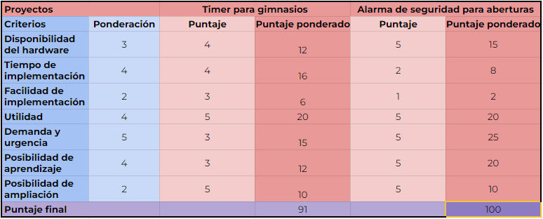
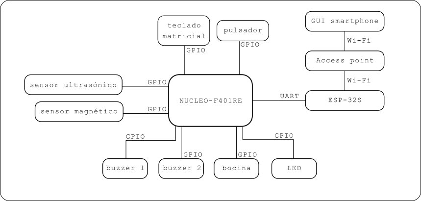

# Trabajo Práctico Final
## Datos
- Nombre: Alarma de seguridad para aberturas
- Alumno: Fernando Augusto González
## Proyectos a evaluar

Los proyectos a analizar son dos, de acuerdo a una cuestión de personal de necesidad coyuntural y motivación:
- **Timer para gimnasios:** Un temporizador programable con tiempos de ejercitación y descanso, y número de repeticiones. Los datos se muestran mediante un display de cuatro dígitos de siete segmentos cada uno. Posee una botonera para configurar las cuentas regresivas e iniciar y pausar la cuenta, también posee una interfaz de usuario mediante smartphone y conexión BLE para realizar las mismas acciones. Posee un buzzer para avisar al usuario que la cuenta termina. Posee LEDs indicadores del modo de funcionamiento activo en un momento dado.
- **Alarma de seguridad para aberturas**: Un sistema que monitoree la abertura de una casa mediante sensores magnéticos para avisar al usuario mediante Wi-Fi si la abertura fue abierta. Cuenta con sonidos de advertencia mediante buzzer si detecta presencia frente a la abertura y sonidos de alarma de mayor intensidad mediante bocina si dicha presencia persiste o si la abertura fue abierta. 

Se consideró los siguientes criterios y sus respectivas ponderaciones:
- **Disponibilidad del hardware**: Si se cuenta con los materiales e insumos necesarios para comenzar la implementación sin demoras por motivos de compra de materiales. A mayor disponibilidad mayor valor. Ponderación 3.
- **Tiempo de implementación**: Cuánto tiempo tomaría dejar operativo el proyecto. A menor tiempo mayor valor. Ponderación 4.
- **Facilidad de implementación**: Cuán difícil sería realizar la implementación del hardware. A menor dificultad mayor valor. Ponderación 2.
- **Utilidad**: Cuánto valor agregaría su uso. A mayor utilidad mayor valor. Ponderación 4.
- **Demanda y urgencia**:  Cuán necesario es contar con el proyecto implementado. A mayor necesidad mayor valor. Ponderación 5.
- **Posibilidad de aprendizaje**: Qué desafío presenta el proyecto en términos de adquisición de conocimientos. A mayor posibilidad mayor valor. Ponderación 4.
- **Posibilidad de ampliación**: Qué posibilidades tiene el proyecto de expandirse para implementar nuevas funcionalidades en futuras etapas. A mayor posibilidad mayor valor. Ponderación 2.

Los criterios usados para la evaluación de los proyectos se evaluaron con un valor del 1 al 5. Esto es debido a que los criterios corresponden a apreciaciones personales y resultó más fácil establecer un puntaje en ese rango que en un rango más amplio (por ejemplo del 1 al 10). 
## Evaluación de proyectos
### Timer para gimnasios
- **Disponibilidad del hardware**: 4. Se establece este puntaje debido a que se tiene en cuenta la disponibilidad de un display de cuatro dígitos y 7 segmentos de 40 cm de ancho por 20 cm de alto aproximadamente, fabricado con leds de 5mm de alto brillo. Pero además es necesario hacer correcciones sobre algunas conexiones del display porque los cables no tienen buena presentación y si bien los mismos se encuentran invisibles al usuario final, por una cuestión de gusto personal se establece el requerimiento de mejorar la presentación del conexionado.
- **Tiempo de implementación**: 4. Se establece este puntaje debido a que se cuenta con una implementación similar del proyecto en cuestiones de hardware. Entonces los cambios más importantes pasan por el firmware.
- **Facilidad de implementación**: 3. A simple vista los desafíos más importantes son la utilización de programación orientada a objetos y escritura de los drivers de los módulos que componen el proyecto. Si bien se cuenta con conocimientos de programación orientada a objetos, el paradigma fue usado en lenguajes como Python y Javascript. Por tanto el uso de ese paradigma con el lenguaje C++ presenta un desafío. Además, en el pasado se usó bibliotecas de código escritas por usuarios desconocidos, para el entorno Arduino; la realización de este proyecto implicaría a priori la realización de bibliotecas propias, por lo que también representa un desafío. 
- **Utilidad**: 5. Una implementación similar de este proyecto fue usada en gimnasios. La realización de este proyecto sustituiría esa implementación anterior, por lo que es un proyecto de mucha utilidad.
- **Demanda y urgencia**:  Este proyecto tiene demanda, es decir, hay ciertos usuarios a la espera de una implementación. Sin embargo no es un proyecto urgente. Se establece un puntaje de 3.
- **Posibilidad de aprendizaje**: 3 Lo descrito en el criterio 'dificultad de implementación' implica una alta posibilidad de aprendizaje. Sin embargo, se establece este puntaje debido a que ya se cuenta con una implementación previa y, si bien es una implementación más básica, ya se conoce la problemática y las cuestiones a resolver son más de implementación que de diseño.
- **Posibilidad de ampliación**: 5. Una vez finalizado el proyecto, se pueden incluir otras etapas en donde se agregue un display de 7 segmentos para indicar el número de repeticiones en todo momento, otra etapa en donde se agregue una placa de sonido para reproducir sonidos desde una tarjeta SD, etc. 
- **Puntaje final ponderado**: 91

### Alarma de seguridad para aberturas
- **Disponibilidad del hardware**: 5. Se cuenta con todos componentes necesarios para realizar la implementación
- **Tiempo de implementación**: 2. Se establece este puntaje debido a que todo el sistema deberá diseñarse, nunca se trató esta problemática con anterioridad, por lo que es un desafío nuevo. 
- **Facilidad de implementación**: Se mantiene lo dicho en la evaluación anterior de que "_los desafíos más importantes son la utilización de programación orientada a objetos y escritura de los drivers de los módulos que componen el proyecto_". Pero además, al ser una problemática nueva, presenta una dificultad mayor. Se establece un puntaje de 1.
- **Utilidad**: 5. Esta implementación será muy útil para mejorar la seguridad del hogar y llevar mayor tranquilidad a los usuarios. 
- **Demanda y urgencia**:  Este proyecto tiene demanda, es decir, hay ciertos usuarios a la espera de una implementación. Es un proyecto urgente. Se establece un puntaje de 5.
- **Posibilidad de aprendizaje**: Al ser una problemática nueva, la posibilidad de aprendizaje es muy grande. Se diseñaría el sistema desde el inicio involucrando muchos conceptos nuevos adquiridos en el curso. Destaco el uso de las Wi-Fi que representa un desafío particular ya que hasta el momento no había tomado contacto con el tema. Se establece un puntaje de 5.
- **Posibilidad de ampliación**: 5. Una vez finalizado el proyecto, se pueden incluir otras etapas en donde se agreguen sensores infrarrojos, encendido y apagado automático de luces, posibilidad de crear un sistema tipo _smart home_ incluyendo el presente proyecto de seguridad.
- **Puntaje final ponderado**: 100

Se resume la evaluación anterior en la tabla 1: 

Tabla 1. Evaluación de los proyectos preseleccionados

## Resultado de la evaluación
El proyecto con mayor puntaje es **Alarma de seguridad para aberturas**. Los valores que agrega este proyecto son varios. En principio la posibilidad de aprendizaje, teniendo en cuenta el uso del paradigma de la programación orientada a objetos en el lenguaje C++, el uso de máquina de estados, el uso de un display LCD y el protocolo Wi-Fi. Luego, la satisfacción de una necesidad personal, debido a un robo en mi hogar recientemente. Otro elemento a destacar es la función de disuación implementada mediante un buzzer, de manera de proporcionar una advertencia previa antes de hacer sonar la sirena principal si es que la señal de advertencia se mantiene activa durante cierto tiempo programado. Por último, este proyecto es de suma importancia para que los usuarios tengan más tranquilidad, sobre todo durante el tiempo de descanso nocturno, incrementando la calidad del sueño.

En la Fig. 1 se presenta el diagrama en bloques del sistema. Se observa los periféricos a utilizar y el modo de conexión con la unidad central de procesamiento constituida por la placa NÚCLEO-F401RE.

Figura 1. Diagrama en bloques del sistema

Cabe destacar que **este proyecto se considera como una primer etapa** de un sistema de **alarma para el hogar**. En implementaciones futuras se considera agregar etapas en donde se involucren sensores infrarrojos y magnéticos para colocar sobre puertas y otras ventanas e introducir nuevas funcionalidades que mejoren la experiencia del usuario. Debido a los tiempos de implementación se propone este proyecto como final del curso con la idea de lograr un proyecto alcanzable en un corto tiempo.

---
## Periféricos
Se considera la instalación de algunos periféricos sobre una ventana de dos hojas.

- Sensores magnéticos: Similar al de [este link](https://www.mercadolibre.com.ar/sensor-magnetico-para-alarma-puerta-ventana-precableado/p/MLA28522217#polycard_client=search-nordic&searchVariation=MLA28522217&position=13&search_layout=stack&type=product&tracking_id=d17efc7b-a2ca-45d7-8cee-286b9a0e3c41&wid=MLA1400275267&sid=search). La separación del par indicará que la abertura está abierta. Irá colocado sobre las hojas de la ventana.
- Sensor ultrasónico: Similar al de [este link](https://www.mercadolibre.com.ar/sensor-ultrasonico-ultrasonido-hc-sr04-arduino-pic-robotica/p/MLA32487259#polycard_client=search-nordic&searchVariation=MLA32487259&position=2&search_layout=grid&type=product&tracking_id=9d0eb95d-a09c-4aa9-a774-c3e061973915&wid=MLA1666030294&sid=search). Irá colocado sobre la parte superior del marco exterior de la ventana y cuando no tenga algún obstáculo en su camino, la distancia medida será la altura del marco de la ventana. Se espera que ante la detección de un obstáculo la distancia medida será menor.
- Buzzer 1: Irá colocado en la parte exterior de la ventana y se activará de acuerdo la detección de algún obstáculo por parte del sensor ultrasónico
- Buzzer 2: Irá colocado en el interior de la casa y se activará en los momentos de activación/desactivación del sistema
- Bocina: Irá colocado en la parte exterior de la ventana y se activará de acuerdo a la señal de apertura del sensor magnético
- LED 1: Indicará que el sistema está activo
- GUI smartphone: Indicará al usuario los eventos registrados.
- Teclado matricial: Permitirá al usuario activar/desactivar el sistema mediante contraseña
## Análisis de sistemas disponibles en el mercado

| Características     |                                                                                                                            Sensor Magnético Para Puertas Ventanas Programable GADNIC                                                                                                                            |                                                                                                                   Sensor Puerta Ventanas Smart Macroled                                                                                                                    |                                                                                                                               Sensor Wifi Para Puertas Y Ventanas Inteligente Magnetico Smart Life Demasled                                                                                                                                |
| ------------------- | :-------------------------------------------------------------------------------------------------------------------------------------------------------------------------------------------------------------------------------------------------------------------------------------------------------------: | :------------------------------------------------------------------------------------------------------------------------------------------------------------------------------------------------------------------------------------------------------------------------: | :----------------------------------------------------------------------------------------------------------------------------------------------------------------------------------------------------------------------------------------------------------------------------------------------------------------------------------------: |
| Link                | [link](https://www.mercadolibre.com.ar/sensor-magnetico-para-puertas-ventanas-programable-gadnic-color-blanco/p/MLA37727542#polycard_client=search-nordic&searchVariation=MLA37727542&position=7&search_layout=grid&type=product&tracking_id=81ffb99e-d582-43cb-87d1-817b66405685&wid=MLA1880559174&sid=search) | [link](https://www.mercadolibre.com.ar/sensor-puerta-ventanas-smart-macroled-facil-instalacion/p/MLA24158832/#reco_backend=comparator-default-odin&reco_client=pdp_comparator&reco_product_pos=2&reco_backend_type=low_level&reco_id=ee344f98-218d-4ddd-b875-011309416c22) | [link](https://www.mercadolibre.com.ar/sensor-wifi-para-puertas-y-ventanas-inteligente-magnetico-smart-life-demasled/p/MLA37369089?pdp_filters=seller_id%3A182950451#reco_item_pos=0&reco_backend=machinalis-seller-items-pdp&reco_backend_type=low_level&reco_client=pdp-seller_items-above&reco_id=92a71589-3e92-4cdc-9826-c5ef6566d1da) |
| Precio              |                                                                                                                                                   $ 26.499,00                                                                                                                                                   |                                                                                                                                  $ 17.999                                                                                                                                  |                                                                                                                                                                  $21.850                                                                                                                                                                   |
| Inalámbrico         |                                                                                                                                            Sí. Con Wi-Fi y Bluetooth                                                                                                                                            |                                                                                                                                     Sí                                                                                                                                     |                                                                                                                                                                     Sí                                                                                                                                                                     |
| Display LCD         |                                                                                                                                                       NO                                                                                                                                                        |                                                                                                                                     NO                                                                                                                                     |                                                                                                                                                                     NO                                                                                                                                                                     |
| Código de seguridad |                                                                                                                                        No. Se activa/desactiva con botón                                                                                                                                        |                                                                                                                     No. Se activa/desactiva con botón                                                                                                                      |                                                                                                                                                     No. Se activa/desactiva con botón                                                                                                                                                      |
| Compatible con App  |                                                                                                                                                       Sí                                                                                                                                                        |                                                                                                                                     Sí                                                                                                                                     |                                                                                                                                                                     Sí                                                                                                                                                                     |
| Sensores            |                                                                                                                                         1 sensor magnético inalámbrico                                                                                                                                          |                                                                                                                       1 sensor magnético inalámbrico                                                                                                                       |                                                                                                                                                       1 sensor magnético inalámbrico                                                                                                                                                       |
| Sonido              |                                                                                                                                                       SÍ                                                                                                                                                        |                                                                                                                                     NO                                                                                                                                     |                                                                                                                                                                     SÍ                                                                                                                                                                     |

## Requerimientos del sistema
| Grupo             | Id  | Descripción                                                                                                                                                                                                                                                                                                                                                                                                                      |
| ----------------- | --- | -------------------------------------------------------------------------------------------------------------------------------------------------------------------------------------------------------------------------------------------------------------------------------------------------------------------------------------------------------------------------------------------------------------------------------- |
| 1. LED            | 1.1 | Debe encenderse cuando la alarma está activa                                                                                                                                                                                                                                                                                                                                                                                     |
|                   | 1.2 | Debe apagarse cuando la alarma está inactiva                                                                                                                                                                                                                                                                                                                                                                                     |
|                   |  1.3   | Debe titilar cuando el usuario esté ingresando una contraseña y volver a su estado anterior en caso de contraseña incorrecta. Esto es, debe apagarse el LED si el usuario quiere activar el sistema pero ingresa una contraseña incorrecta o se agota el tiempo de espera o debe encenderse el LED si el sistema está activo y el usuario quiere desactivarlo e ingresa una contraseña incorrecta o se agota el tiempo de espera |
| 2. NUCLEO F401RE  | 2.1 | Debe solicitar una contraseña de 4 dígitos para activar/desactivar el sistema que se ingresará mediante el teclado matricial                                                                                                                                                                                                                                                                                                     |
|                   | 2.2 | Debe tener un tiempo límite de espera 30 segundos para desactivar la alarma                                                                                                                                                                                                                                                                                                                                                      |
|                   |  2.3  | Debe esperar treinta segundos para activar la alarma una vez que se ingresa la contraseña correcta. Esto es con la intención de brindar la posibilidad al usuario de salir de la casa antes de que el sistema se active.                                                                                                                                                                                                         |
|                   | 2.4 | Debe establecer un estado de advertencia mientas el sensor ultrasónico arroje una medición inferior a la altura del marco de la ventana con una tolerancia de ±5% de esa longitud                                                                                                                                                                                                                                                |
|                   | 2.5 | Debe establecer un estado de alarma si el estado de advertencia permaneció activo durante más de 30 segundos                                                                                                                                                                                                                                                                                                                     |
|                   | 2.6 | Debe establecer un estado de alarma si se separó el par de contactos magnéticos y el sistema está activo                                                                                                                                                                                                                                                                                                                         |
| 3. Buzzer 1       | 3.1 | Debe emitir pitidos intermitentes cada 500 ms si el estado de advertencia está activo                                                                                                                                                                                                                                                                                                                                            |
|                   | 3.2 | No debe emitir sonido mientras el sistema no esté en estado de advertencia                                                                                                                                                                                                                                                                                                                                                       |
| 4. Buzzer 2       | 4.1 | Debe emitir pitidos intermitentes cada 1000 ms durante 30 segundos, en el periodo entre que se ingresa la contraseña correcta y se cumplen el tiempo de espera para entrar en estado de activación                                                                                                                                                                                                                               |
|                   | 4.2 | Debe emitir dos pitidos con un silencio en el medio cuando el sistema agotó el tiempo de espera para activarse (30 segundos) y entró en el estado activo                                                                                                                                                                                                                                                                         |
|                   | 4.3 | Debe emitir dos pitidos con un silencio en el medio cuando el sistema está activo y el usuario ingresa la contraseña correcta para desactivar                                                                                                                                                                                                                                                                                    |
| 5. Bocina         | 5.1 | Debe sonar la bocina si el estado de alarma está activo                                                                                                                                                                                                                                                                                                                                                                          |
|                   | 5.2 | No debe sonar la bocina si el estado de alarma no está activo o si el mismo está activo pero se ingresa la contraseña correcta para desactivar el sistema                                                                                                                                                                                                                                                                        |
| 6. Pulsador       | 6.1 | Debe hacer sonar la bocina mientras el pulsador está presionado                                                                                                                                                                                                                                                                                                                                                                  |
|                   | 6.2 | No debe realizar disparar ninguna acción si el pulsador no es presionado                                                                                                                                                                                                                                                                                                                                                         |
| 7. GUI smartphone | 7.1 | Al conectarse al sistema debe leer el estado activo/inactivo de los sensores ultrasónico y magnético. Asimismo debe leer si el sistema está activo o inactivo.                                                                                                                                                                                                                                                                   |

## Casos de uso

| CU 1              | El usuario desea activar el sistema                                                                                                                                                           |
| ----------------- | --------------------------------------------------------------------------------------------------------------------------------------------------------------------------------------------- |
| Disparador        | El usuario desea activar el sistema                                                                                                                                                           |
| Precondición      | La alimentación del sistema está conectada y el sistema está inactivo.                                                                                                                        |
| Flujo básico      | El usuario ingresa la contraseña correcta mediante el teclado matricial, el buzzer 2 suena de forma intermitente durante 30 segundos y finalizado ese periodo el sistema entra en modo activo |
| Flujo alternativo | El usuario no ingresa la contraseña correcta o demora más de treinta segundos en completar el ingreso de la contraseña. En ese caso el sistema no se activa.                                  |

| CU 2              | El sistema debe entrar en modo advertencia                                                                                                                                                                 |
| ----------------- | ---------------------------------------------------------------------------------------------------------------------------------------------------------------------------------------------------------- |
| Disparador        | El sistema detecta un obstáculo en el rango de detección del sensor ultrasónico                                                                                                                            |
| Precondición      | El sistema está activo, el sensor ultrasónico arroja un valor medido de distancia igual a la altura del marco de la ventana y par de sensores magnéticos están juntos (indica que la ventana está cerrada) |
| Flujo básico      | El buzzer 1 (que está colocado en la ventana) emite un sonido discontinuo mientras el obstáculo esté presente. Si el obstáculo desaparece el sonido finaliza.                                              |
| Flujo alternativo | El obstáculo no es detectado por el sensor ultrasónico y el buzzer no suena. Si la ventana se abre el sistema debe entrar en modo alarma y hacer sonar la bocina.                                          |

| CU 3              | El sistema debe entrar en modo alarma                                                                                                                                                              |
| ----------------- | -------------------------------------------------------------------------------------------------------------------------------------------------------------------------------------------------- |
| Disparador        | El sistema detecta que los contactos magnéticos se separaron, indicando que la ventana fue abierta                                                                                                 |
| Precondición      | El sistema está activo y los contactos magnéticos están juntos.                                                                                                                                    |
| Flujo básico      | El sistema entra en modo alarma y hace sonar la bocina hasta que el usuario ingresa la contraseña correcta o se interrumpa la alimentación.                                                        |
| Flujo alternativo | La apertura de los contactos magnéticos no se detectó correctamente. El sistema debe entrar en modo alarma si el sensor ultrasónico detecta un obstáculo en su camino por más de treinta segundos. |

| CU 4              | El usuario desea desactivar el sistema                                                                                                                                                                                                                                                                                                                                      |
| ----------------- | --------------------------------------------------------------------------------------------------------------------------------------------------------------------------------------------------------------------------------------------------------------------------------------------------------------------------------------------------------------------------- |
| Disparador        | El usuario desea desactivar el sistema                                                                                                                                                                                                                                                                                                                                      |
| Precondición      | La alimentación del sistema está conectada y el sistema está activo.                                                                                                                                                                                                                                                                                                        |
| Flujo básico      | El usuario ingresa la contraseña correcta mediante el teclado matricial, el buzzer 2 suena dando dos pitidos con un silencio en el medio y el sistema entra en modo inactivo                                                                                                                                                                                                |
| Flujo alternativo | El usuario no ingresa la contraseña correcta o demora más de treinta segundos en completar el ingreso de la contraseña. En ese caso el sistema el sistema da una segunda oportunidad para ingresar la contraseña correcta pero el buzzer 2 debe emitir pitidos intermitentes. Si se ingresa una contraseña incorrecta o se agota el tiempo de espera, debe sonar la bocina. |
